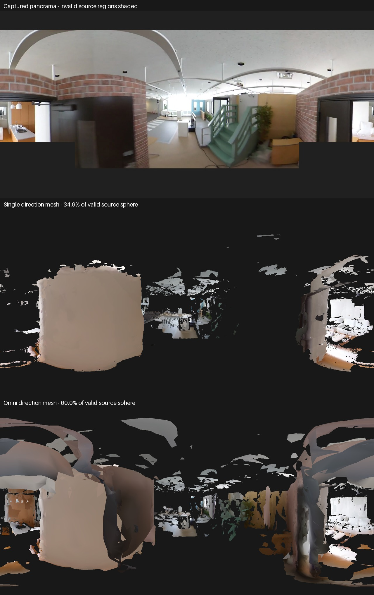
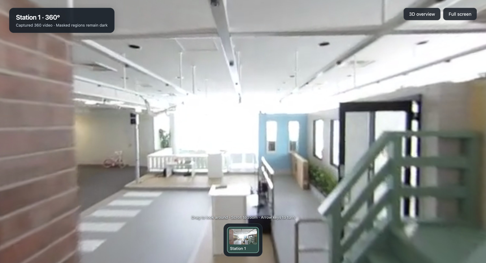

# AIST indoor omnidirectional reconstruction pilot

The 12-second pilot completes on the Mac, but both tested meshes fail fidelity screening.
Four panorama directions increase coverage at one checked station from 34.89% to 60.01% of valid source directions, while overlapping walls and missing surfaces remain visible.
A separate station uses the actual captured 360 panorama and works in the existing interactive property viewer.
No FixAnything inference or full-video run was launched.

## Input and comparison

The input is the equirectangular version of AIST Living Lab 1 from the [official stella_vslam sample datasets](https://stella-cv.readthedocs.io/en/latest/simple_tutorial.html#equirectangular-datasets).
The original video is 1920 by 960 pixels and 136 seconds long.
Only the interval beginning at 45 seconds is tested, using 24 capture times spaced approximately 0.5 seconds apart.
Exact decoded frame indices and timestamps are recorded in `projection.json`.

The baseline uses one forward direction per capture time, giving 24 images.
The omnidirectional arm uses headings 0, 90, 180, and 270 degrees at each of those same capture times, giving 96 images.
Both use 518 by 294 perspective images with a known 100-degree horizontal field of view.
All selected perspective pixels avoid the invalid rectangles supplied in AIST's camera configuration.
The source panoramas retain a separate validity mask; a 2:1 image does not imply that the whole sphere is observed.

The four directions are ordered as alternating forward and reverse temporal traversals.
This gives the existing depth-support filter neighboring views with translation rather than four consecutive images taken at one position.
The native LingBot path predicts its own intrinsics and camera poses; it does not enforce the known projection calibration or shared optical centers.
Both arms use the same long checkpoint, bfloat16 MPS inference, and a single 96-frame window, followed by existing depth filtering, TSDF fusion, GLB export, and source-view validation.
The first 24 RGB, depth, confidence, intrinsic, and extrinsic arrays are bitwise identical between arms.
There is one run per arm, so these are individual experimental observations rather than repeated-run performance estimates.

## Observed results

| Check | One direction | Four directions |
| --- | ---: | ---: |
| Input views | 24 | 96 |
| Full mesh triangles | 2,286,968 | 6,497,590 |
| Exported GLB triangles | 300,000 | 299,999 |
| GLB coverage at common reserved frame 5 | 47.50% | 60.20% |
| GLB coverage at common reserved frame 15 | 32.72% | 47.43% |
| Depth support at common reserved frame 15 | 12.24% | 9.56% |
| Coverage of valid source sphere at checked station | 34.89% | 60.01% |
| Full-valid-source, latitude-weighted station RGB L1 | 0.39649 | 0.32918 |
| Existing mesh fidelity gate | Fail | Fail |

The station is source video frame 1573, at 52.4858 seconds.
It uses the same forward-camera pose in both arms, so the spherical comparison does not change the viewpoint between candidates.
Coverage is weighted by latitude and restricted to the same source-validity mask.
The source mask retains 68.38% of panorama pixels and 85.58% of spherical solid angle.
The captured panorama itself is the unchanged appearance baseline: it retains every valid source pixel and has zero self-comparison error.
That identity check is not evidence of correct mesh geometry.

Common forward frames 5 and 15 are excluded from fusion in both arms but still participate in learned inference.
Other headings from the same physical capture time can participate in fusion, so these checks are not an independent building survey.
The extra directions improve coverage but worsen RGB error and depth support at both common forward validation views.
Visual inspection shows large holes, overlapping wall fragments, and distorted surfaces.



## Camera constraint audit

The four projected cameras at each timestamp should share one center and have exactly known relative rotations.
Across 24 capture times and 72 relative-rotation comparisons, the native predictions have a median rotation error of 2.07 degrees and a maximum of 10.32 degrees.
The median maximum center disagreement is 0.08778 model units, compared with a reference median scene depth of 0.43077 model units.
The normalized disagreement is 20.38% of that depth statistic; it is not a metric distance or percentage error in building dimensions.
Median absolute focal-length disagreement with the known projection calibration is 8.66%.

These measurements establish that the current native path does not recover the known panoramic rig exactly.
They do not isolate every cause of the missing mesh surfaces.
The next geometry experiment should enforce shared camera centers, fixed relative rotations, and known perspective calibration, then repeat the same source comparisons.
Increasing video length or adding generative filling is not justified by this failed pilot.

## One captured station

The existing viewer loads the rough GLB and one station containing actual captured panorama pixels.
Source-invalid regions remain dark, and the viewer identifies this appearance as captured 360 video.
The mesh overview reports that the mesh needs review.
The overview now uses geometry bounds so a single station does not frame only its camera marker.
Browser checks confirm station entry, drag rotation, keyboard rotation, wheel zoom, and return to the 3D overview, with no displayed error.
The panorama is real source imagery; the associated model remains unverified and is not loop-closed.



## Reproduction and artifacts

```sh
.venv-reconstruction/bin/python -m artifacts.research.experiments.prepare_aist_omni_pilot \
  --video reconstructions/datasets/aist-indoor-pilot-v1/aist_living_lab_1/video.mp4 \
  --output reconstructions/omni/aist-new-pilot

.venv-reconstruction/bin/python -m lingbot_map.reconstruction run \
  --images reconstructions/omni/aist-new-pilot/single/images \
  --output reconstructions/omni/aist-new-pilot/single/run \
  --camera-source native --window 96 --overlap 24

.venv-reconstruction/bin/python -m lingbot_map.reconstruction run \
  --images reconstructions/omni/aist-new-pilot/omni/images \
  --output reconstructions/omni/aist-new-pilot/omni/run \
  --camera-source native --window 96 --overlap 24

.venv-reconstruction/bin/python -m artifacts.research.experiments.evaluate_aist_omni_pilot \
  --pilot reconstructions/omni/aist-new-pilot \
  --output reconstructions/omni/aist-new-pilot/evaluation

.venv-reconstruction/bin/python -m lingbot_map.reconstruction tour-view \
  --output reconstructions/omni/aist-new-pilot/evaluation/captured-tour --port 8084
```

The reconstruction commands return exit status 2 when completed artifacts fail screening; inspect them before proceeding.
The preserved local run is `reconstructions/omni/aist-living-lab-1-pilot-v1`.
Its `evaluation-v1` directory contains the source panorama, source mask, both rendered mesh panoramas, radial-depth images, comparison sheet, camera diagnostics, and captured-station tour.
The four-direction GLB occupies 5,424,548 bytes.
The pilot occupies approximately 0.88 GB including predictions, geometry, perspective inputs, and evidence.
The second downloaded walkthrough was not processed.

All 65 repository tests pass, including new cardinal-direction, source-mask, and shared-camera constraint tests.
Ruff passes the changed Python files.
The [machine-readable result](evidence/aist-indoor-result.json) preserves the complete 72-pair camera audit and per-arm observations.
This experiment tracks issue #8; the unresolved building-fidelity work remains separate.
