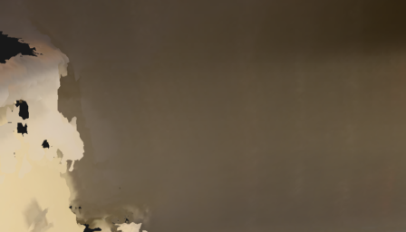
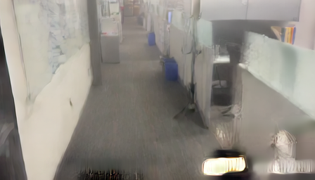

# FixAnything panorama conditioning investigation

Reviewed against the released code, author examples and paper on 2026-09-09.
The generation process was stopped at the user's request after nine saved denoising checkpoints.
It produced no completed 61-frame image set or stitched panorama.
The five-frame smoke test is not an end-to-end panorama test and must not be presented as one.

## Evidence from the current input

The station-000 sequence contains 61 camera poses but only one unique captured anchor image, repeated at indices 0 and 60.
Of its renders, 18 contain no observed surfaces and 24 contain less than 10% observed surface.
The sampled directions below are relative to the captured camera, not an independently estimated gravity frame.

| Sample | Frame | Observed render pixels |
| --- | --- | --- |
| Forward | 25 | 90.3% |
| Right | 28 | 31.8% |
| Backward | 31 | 0.0% |
| Left | 34 | 6.8% |
| Downward | 4 | 98.9% |
| Upward | 57 | 0.0% |

Adjacent camera rotations have a median change of 30.0 degrees and a maximum of 53.6 degrees.
This is a measured property of our path, not an established FixAnything speed limit.
All six exported station sweeps contain between 18 and 21 entirely empty renders.
Changing only the selected station does not remove the input deficiency.

In the completed smoke test, input frame 004 shows the floor while generated frame 004 still shows the forward corridor.
That output cannot be reprojected using its intended downward rotation to obtain the correct building view.
The smoke test used five frames at 448 by 256 and two denoising steps, so it does not establish how the complete released configuration would perform.

The sampled counts and paths are recorded in [the input inspection](evidence/sweep-input-inspection.json).
The local [sample gallery](http://127.0.0.1:8083/sweep-inspection-v1.html) shows the six directions and the exact downward input/output pair.

## What the authors actually provide

The [paper, sections 3.2 and 3.3](https://arxiv.org/html/2608.23549) identifies the degraded rendering as the camera and layout conditioning signal.
Training uses 61-frame trajectories passing through at least two captured training views, drawn from reconstructions built with 3 to 12 images.
Clean frames can occur inside the sequence.
This supports using distinct observed views as anchors; it does not guarantee successful conditioning with our repeated endpoint image and blank directions.

The [author project page](https://fix-anything.github.io/) processes longer trajectories in overlapping chunks with shared clean anchors.
That suggests testing smooth, overlapping local segments for a spherical path.
It is a proposed adaptation, not a published guarantee for stitched panoramas.

The [released inference helper](https://github.com/kvuong2711/fix-anything/blob/744023e987920af352b880f60cc8841c96a0a105/scripts/run_inference.py) defaults to 61 frames at 832 by 480, ten steps and guidance scale 5.
It appends four copies of the last frame for the temporally compressed VAE, then trims the output to 61 frames.
Our stopped run used those defaults.
The local checkout matches the current upstream commit.

The [released conditioning units](https://github.com/kvuong2711/fix-anything/blob/744023e987920af352b880f60cc8841c96a0a105/fixanything/pipelines/wan_video_v2v_mask_dynamic.py) encode all rendered frames and concatenate the latent representation with a per-frame clean mask.
Camera matrices are not passed directly to the model.
The clean mask is a learned conditioning signal; the released inference does not enforce a pixel-for-pixel copy of clean output frames.
Actual anchor preservation therefore still needs inspection.

The paper's smallest reported denoising ablation uses five steps on a complete 61-frame clip.
Its training begins at 512 by 288 before moving to 832 by 480.
A complete spherical pilot at 512 by 288 and five steps is therefore a reasonable cost-reduction experiment, but its quality must be demonstrated locally.
Reducing the number of directions until the clip no longer covers the sphere is not an acceptable pilot.

An [open hallucination report](https://github.com/kvuong2711/fix-anything/issues/3) has no author reply at inspection time.
It provides no verified parameter fix for our problem.

## Diagnosis and correction sequence

The confirmed integration failure is that we treated a successful runtime test and complete camera-direction sampling as evidence of a usable generated panorama.
They establish neither preserved camera motion nor building fidelity.
Empty renders provide no direct per-frame scene control; whether nearby anchors can recover those directions is unproven here.
Rapid rotations and weak anchor diversity are additional hypotheses, not separately isolated causes.
The MPS rotary precision test also does not prove complete model parity with CUDA.

The immediate correction is an input inspection before weights are loaded.
The Mac runner now rejects incomplete spherical clips, inconsistent clean-anchor metadata, missing or invalid images, and entirely unobserved rendered directions.
It reads every clean anchor from the sweep manifest instead of hard-coding the first and last frames.
The current station-000 input is rejected with its 18 empty indices and one unique clean image reported.
Passing this inspection remains only a prerequisite for a pilot.

Next, repair one station's conditioning by examining the original images, camera poses and scene support in the missing directions.
Design smoother overlapping segments and supply trusted views at their actual compatible poses.
Do not substitute photographs from different camera centers without accounting for parallax.
Do not label a warped or generated approximation as an original captured anchor.
Missing structure cannot be made faithful merely by raising denoising steps or copying the same anchor again.

Before any additional station or higher-cost run, one complete 360 pilot must produce its full image set, stitch at the calibrated dimensions, load in the viewer and preserve observed walls, doors, windows and connectivity in source-photo comparisons.
Compare overlapping generated views against the unchanged rendering baseline and inspect all spherical directions, including both poles and the wrap seam.
Record a pass or failure with actual artifacts.
Generation remains stopped while this input correction is underway.
