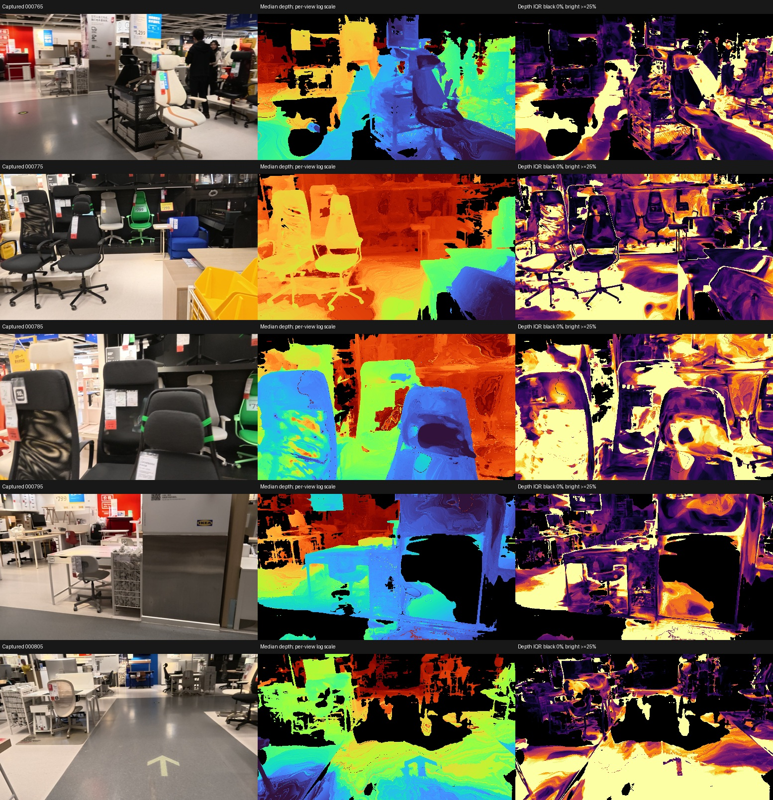
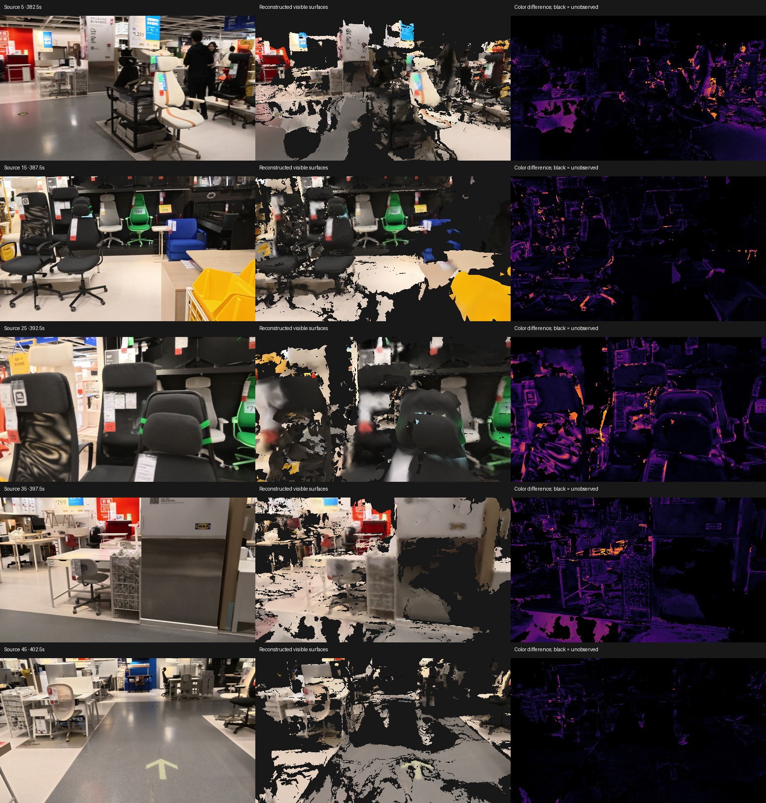
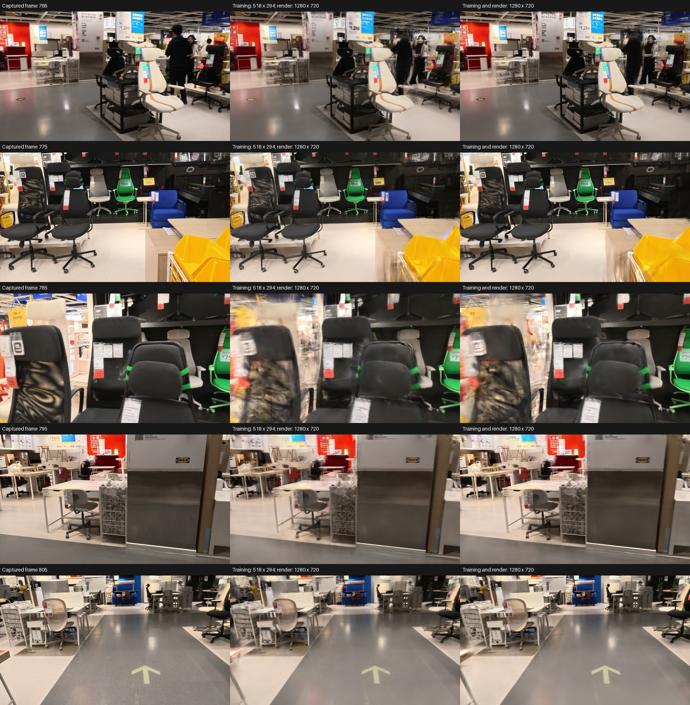
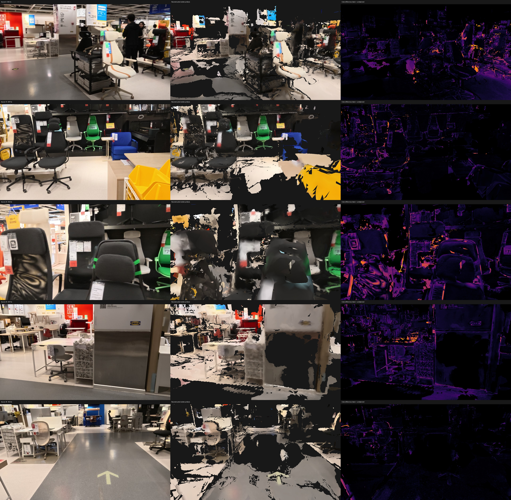

# Recovering surfaces from the native Gaussian model

Recorded on 2026-09-09 on the M3 Max.
The 24-second chair section now has Gaussian-derived triangle meshes and complete local source/app checks.
All three tested extraction variants fail screening; no faithful full-building result is claimed.
This extends [the image and Brush experiments](photometric-and-brush-results.md).

## Renderer compatibility before depth interpretation

The new `gaussian_depth_renderer.py` reads the saved 500,000-Gaussian PLY and renders it in float32 using NumPy and PyTorch on MPS.
Projection, anisotropic covariance, spherical harmonic color and front-to-back alpha compositing follow the inspected [Brush v0.3.0 shaders](https://github.com/ArthurBrussee/brush/tree/3edecbb2fe79d3e2c87eeab85b15e0b1dd10d486/crates/brush-render/src/shaders).
The implementation retains the 0.3-pixel covariance blur, opacity cutoff, near-plane cutoff, half-pixel sampling and early transmittance termination.
Attribution and implementation differences are recorded [beside the source](experiments/BRUSH_ATTRIBUTION.md).

All five reserved views are compared with actual PNGs exported by the native Brush binary.
Mean absolute RGB disagreement ranges from 0.000974 to 0.000981 on a 0-to-1 scale.
The 99th-percentile absolute disagreement is about 0.00194, close to half an eight-bit level; maximum disagreement ranges from 0.00472 to 0.00628.
This supports renderer compatibility, not geometric accuracy.
The same renderer completes all 43 training views and preserves per-frame depth archives, hashes, traces and the exact producer source.

Four analytic tests cover front/back compositing, tilted thin Gaussians, invisible/transparent Gaussians and Brush's early-termination behavior.
The depth outputs include the alpha-weighted mean of Gaussian-center Z, center-depth quantiles and experimental Gaussian depth conditioned on projected pixel location.
Conditional depth uses a linearized perspective projection and the Gaussian covariance.
It is not a trained surface constraint, a posterior confidence estimate or independently measured depth.

## Sparse geometry comparison

The audit samples 4,965 triangulated observations across the five reserved images.
Points require tracks in at least three images, positive camera depth and at most two original-image pixels of reprojection error.
The points participated in COLMAP estimation and some seed geometry, so this is a consistency check against existing geometry rather than independent ground truth.
The observations are not 4,965 independent physical measurements.

The baseline is ordinary alpha-weighted center-depth expectation from the unchanged Gaussian model.
Median extraction selects the Gaussian center at half the accumulated opacity mass.
No Gaussian parameters change in this comparison.

| Original frame | Triangulated observations | Covered observations | Mean-depth median relative error | Median-center median relative error |
|---|---:|---:|---:|---:|
| 765 | 870 | 91.15% | 4.33% | 1.15% |
| 775 | 973 | 97.53% | 5.48% | 0.66% |
| 785 | 529 | 99.05% | 5.01% | 0.99% |
| 795 | 1,622 | 89.77% | 4.91% | 0.82% |
| 805 | 971 | 62.72% | 3.54% | 0.73% |

Coverage in this table requires accumulated opacity above 0.9.
Errors are medians among covered observations; uncovered observations remain excluded from those error medians and visible in the coverage column.
The generated report also records 95th-percentile errors and the fraction of all observations within 5% depth agreement.
At frame 785, median-center extraction agrees within 5% at 85.63% of all reference observations, compared with 49.34% for mean depth.
Its 95th-percentile error among covered observations is still 12.98%.

Conditional median extraction has 1.13% median error at that view, and later fusion does not improve over center-depth median extraction.
Gaussian-center depth often spans several layers along a ray even when RGB looks plausible.
Requiring both a center-depth interquartile range and selected Gaussian width below 5% of depth retains only 13.24% to 30.91% of full-image pixels across these five views.
These width thresholds are diagnostic choices, not calibrated probabilities of accurate geometry.

Depth colors in the middle column use a separate logarithmic range per view and cannot be compared as absolute distances across rows.
The right column shows center-depth interquartile range relative to median depth, with bright pixels at 25% or more.
Black missing pixels have opacity at or below 0.9; they do not establish absent physical surfaces.

## Pixel convention and mesh reconstruction

Brush samples image rays at pixel indices plus 0.5.
The earlier learned-depth archives use the existing integer-index convention.
Routing the new Gaussian depth through the default integer convention shifts a constructed slanted plane by up to 0.003893 model units in both unprojection and Open3D RGBD point construction.
The new archive metadata explicitly carries `pixel_center_offset: 0.5`.
Unprojection and neighbor sampling honor it, and RGBD integration adjusts the principal point accordingly.
The original integer-index behavior remains the default for existing archives.
Three additional tests verify recovery of the physical plane, agreement with Open3D rays and preservation of the earlier convention.

The mesh experiment retains the same 43 training images and five reserved images.
It accepts Gaussian depth only where accumulated opacity exceeds 0.9, then applies the existing depth-edge and neighboring-view support filters.
TSDF color comes from captured training RGB rather than spherical harmonic render colors.
Both the full surface PLY and the exported GLB are checked at all five reserved views.

| Exported extraction | Median coverage | Median depth support | Minimum depth support | Median visible RGB error | Screening |
|---|---:|---:|---:|---:|---|
| Mean center depth | 52.81% | 36.85% | 30.57% | 0.07435 | Failed |
| Median center depth | 65.60% | 68.86% | 60.11% | 0.07666 | Failed |
| Conditional median depth | 56.65% | 62.90% | 35.34% | 0.07195 | Failed |

Depth-support references here are the extracted Gaussian depths, not surveyed surfaces or the earlier Lingbot depth predictions.
The depth-support percentages therefore cannot establish cross-model accuracy superiority.
The full median-center mesh has 67.74% median coverage, 71.99% median depth support and 63.13% minimum depth support.
It also fails the 70% median-coverage requirement.
The automatic voxel sizes are 0.002485, 0.002339 and 0.002352 model units respectively, so these are complete extraction-pipeline comparisons rather than a fixed-resolution raster-only ablation.

Median-center extraction produces 1,853,368 full triangles and a 300,000-triangle app mesh.
The app asset is `reconstructions/brush-mesh-760-median/model/property.glb`, SHA-256 `d75847bfa60664ece2f7d78da1f2a83ee0e2665906dbf0ab50e29cd8ae14da28`.
Its reserved chair view has 77.38% visible coverage, but still shows broken edges and missing surrounding surfaces.
The last reserved view has only 44.73% visible coverage.
This artifact is retained as a local improvement over mean-depth extraction, not promoted as a complete or verified property model.

The figure's local frame numbers map to original frames by adding 760.
The complete test suite passes 46 tests after these changes.

## Completed image-resolution comparison

The completed models above train from 518-by-294 processed RGB.
A new dataset retains the original extracted 1280-by-720 JPEG pixels, decoded to PNG, with COLMAP's corresponding raw calibration.
It preserves the exact 9,482 seed points and colors, camera poses and 43/5 frame assignment.
It does not claim to restore the original video's 4K detail.
The higher-resolution trial completes 10,000 steps, reaches 500,000 Gaussians and allows growth through step 8,000.
The recorded single run takes 339.50 seconds; this is not a controlled performance benchmark.
Its final PLY has SHA-256 `72a7d64c2d5daf0bec08a271d92b7676192b3762754ddc3fbf827b1c258dd498`.

Both saved models are rendered at the same calibrated 1280-by-720 camera views with the same float32 renderer and captured reference images.
All pixels enter the image metrics after the same eight-bit conversion.
This avoids comparing native training metrics measured at different resolutions.

| Original frame | Trained at 518 by 294, PSNR | Trained at 1280 by 720, PSNR |
|---|---:|---:|
| 765 | 20.54 dB | 22.05 dB |
| 775 | 23.83 dB | 25.25 dB |
| 785 | 17.80 dB | 18.52 dB |
| 795 | 23.44 dB | 24.38 dB |
| 805 | 22.84 dB | 25.41 dB |
| Mean | 21.69 dB | 23.12 dB |

Mean full-image absolute RGB error falls from 0.04841 to 0.03936.
The high-resolution model's float32 render agrees with native exported PNGs to mean absolute error between 0.000977 and 0.000979.
The old model has no native exported 1280-pixel reference, so its native compatibility at that resolution is explicitly unmeasured.
The close chair view retains ghosting and displaced details despite improved image scores.

At the same 4,965 sparse observations, the fraction within 5% depth agreement improves in every reserved view.
For example, frame 805 improves from 41.71% to 56.13% of all observations, while covered-observation median relative error falls from 0.98% to 0.73%.
This comparison still uses COLMAP geometry involved in camera estimation and cannot establish independent accuracy.

All 43 higher-resolution training views are rendered and fused using median-center depth and the same opacity, edge and neighboring-view support rules.
The complete mesh has 2,175,971 triangles and a voxel size of 0.002312 model units.
Its median visible coverage is 64.14%, with 71.92% median depth support and 68.64% minimum depth support.
The 300,000-triangle app mesh has 61.92% median coverage, 67.78% median depth support and 66.68% minimum depth support.
Both meshes fail screening because surfaces remain missing.
These mesh metrics use 1280-pixel reference views; the earlier mesh table uses 518-pixel reference views and is not a controlled resolution comparison.
The app asset is `reconstructions/brush-mesh-760-high1280-median/model/property.glb`, SHA-256 `c1a5e9dd32d928d6b3b781d70201c714d673b0bf8b0fe832e9002a3ddfa2c33d`.

The remaining surface failures motivate a separate [native CPU multiview stereo experiment with OpenMVS](openmvs-mac-results.md).

An actual property capture and independent measured references remain necessary for the final real estate acceptance check.
