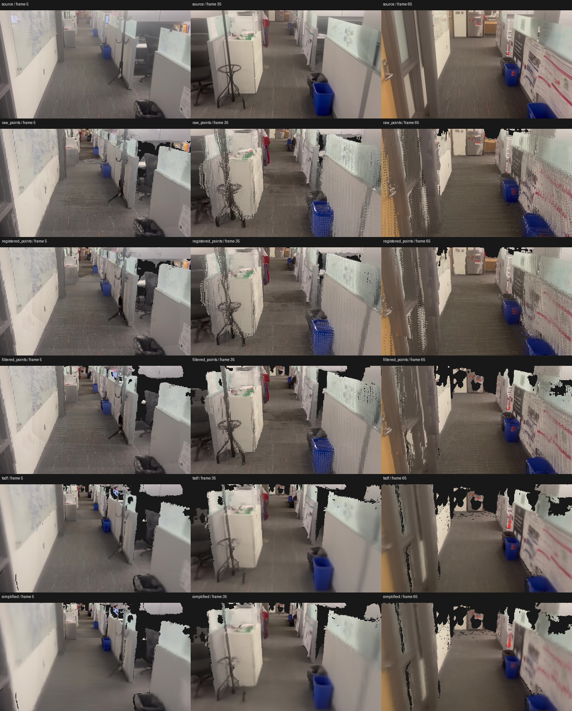

# LingBot quality diagnosis

The local pipeline introduces visible holes and blur after LingBot inference.
A bounded comparison isolates this loss using the same first 72 frames of the supplied office sequence, drawn from a saved 96-frame inference window.
The result does not explain every global layout error or establish metric building accuracy.

## Controlled comparison

Geometry uses 65 frames after excluding every tenth frame.
Frames 5, 35 and 65 are the three displayed evaluation photographs.
These photographs participated in learned inference but are excluded from point accumulation and mesh fusion, so they are not independent ground truth.
All stages use the same image dimensions and corresponding cameras.
The point renderer uses a two-pixel sampling stride, a three-by-three pixel splat and depth buffering; this approximates the official point presentation, not its exact renderer.

| Stage | Mean coverage | Mean whole-image RGB L1 | Mean visible-only RGB L1 |
| --- | ---: | ---: | ---: |
| Raw learned points | 98.75% | 0.06073 | 0.05642 |
| Camera-adjusted points | 98.66% | 0.05556 | 0.05075 |
| Depth-filtered points | 93.57% | 0.07226 | 0.04630 |
| TSDF mesh | 90.30% | 0.07691 | 0.03635 |
| Simplified mesh | 90.05% | 0.07881 | 0.03727 |

The filter retains 71.94% of depth pixels in this sample.
Camera adjustment improves local image agreement.
Filtering removes surfaces, including uncertain partition boundaries.
TSDF fusion creates further holes and averages colors, visibly blurring posters and thin objects.
The mesh contains 1,019,421 triangles before simplification and 150,000 afterward.
Simplification produces a much smaller additional coverage loss in this sample.
The lower visible-only error of the mesh conceals the surfaces it lost; whole-image comparisons and visual review must accompany that score.
The raw point baseline itself still contains doubled edges, so reverting to points alone does not prove faithful geometry.

The reproducible measurements and input hashes are in [the JSON record](evidence/lingbot-stage-comparison.json).
Run `python -m artifacts.research.experiments.compare_lingbot_stages --output <new-directory>` from the repository root using `.venv-reconstruction`.
The tool does not run model inference or modify the saved source reconstruction.

## Differences from the published demonstration

The [official worked example](https://github.com/Robbyant/lingbot-map#worked-example--indoor-travel-long-sequence) renders points from the furniture-store video with 128 cache slots, keyframe interval 10 and eight overlapping keyframes.
Our original downloaded furniture-store video matches that official asset byte for byte, but the current tour uses the separate supplied office sequence.
The official presentation and our current mesh are therefore neither the same capture nor the same representation.
Our Mac adapter instead resets streaming context across 96-frame windows with 24-frame overlap, then adjusts cameras and fuses filtered depth into a mesh.
The effect of these context resets on global quality remains an untested hypothesis in this experiment.

The [paper](https://arxiv.org/html/2604.14141) explicitly lists absent loop closure and accumulated drift from window resets as limitations.
Its stated image size is 518 by 378 for a benchmark setting; the office input is already 518 by 294, with a different aspect ratio.
Increasing its height would not recover missing captured image content.
MPS numerical accuracy relative to CUDA has not been established by this comparison.

## Source photographs for FixAnything

Captured photographs should condition restoration wherever their camera geometry supports them.
The nearest opposite-facing source cameras are displaced from the fixed panorama stations, so directly inserting those photographs at station rotations would introduce parallax errors.
The bounded source-projection experiment samples actual captured RGB at mesh surface projections, rejects source-depth disagreement and occlusion, and records a source-frame map for each output.
It excludes the reserved comparison photographs and keeps projected pixels separate from exact clean-frame anchors.
It does not enlarge the observed mesh footprint or fabricate missing ceiling geometry.

The [FixAnything paper](https://arxiv.org/html/2608.23549) uses rendered trajectories that pass through at least two clean source views during training.
Our repeated endpoint photograph is only one distinct clean view.
Additional exact anchors require trajectories through their actual poses, or validated reprojection, not merely marking unrelated photos clean.
Generation remains stopped until one complete station has usable conditioning.
A complete generated, stitched and visually checked 360 is required before processing any other station.
