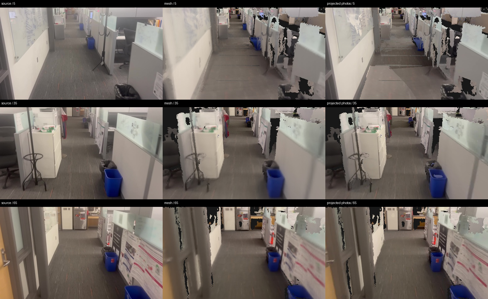

# LingBot quality diagnosis

The local pipeline introduces visible holes and blur after LingBot inference.
A bounded comparison isolates this loss using the same first 72 frames of the supplied office sequence, drawn from a saved 96-frame inference window.
The result does not explain every global layout error or establish metric building accuracy.

## Controlled comparison

Geometry uses 65 frames after excluding every tenth frame.
Frames 5, 35 and 65 are the three displayed evaluation photographs.
These photographs participated in learned inference but are excluded from point accumulation and mesh fusion, so they are not independent ground truth.
All stages use the same image dimensions and corresponding cameras.
The point renderer uses a two-pixel sampling stride, a three-by-three pixel splat and depth buffering; this approximates the official point presentation, not its exact renderer.

| Stage | Mean coverage | Mean whole-image RGB L1 | Mean visible-only RGB L1 |
| --- | ---: | ---: | ---: |
| Raw learned points | 98.75% | 0.06073 | 0.05642 |
| Camera-adjusted points | 98.66% | 0.05556 | 0.05075 |
| Depth-filtered points | 93.57% | 0.07226 | 0.04630 |
| TSDF mesh | 90.35% | 0.07670 | 0.03641 |
| Simplified mesh | 90.14% | 0.07845 | 0.03740 |

The filter retains 71.94% of depth pixels in this sample.
Camera adjustment improves local image agreement.
Filtering removes surfaces, including uncertain partition boundaries.
TSDF fusion creates further holes and averages colors, visibly blurring posters and thin objects.
The mesh contains 956,826 triangles before simplification and 149,999 afterward.
Simplification produces a much smaller additional coverage loss in this sample.
The lower visible-only error of the mesh conceals the surfaces it lost; whole-image comparisons and visual review must accompany that score.
The raw point baseline itself still contains doubled edges, so reverting to points alone does not prove faithful geometry.

The reproducible measurements and input hashes are in [the JSON record](evidence/lingbot-stage-comparison.json).
Run `python -m artifacts.research.experiments.compare_lingbot_stages --output <new-directory>` from the repository root using `.venv-reconstruction`.
The tool does not run model inference or modify the saved source reconstruction.

## Differences from the published demonstration

The [official worked example](https://github.com/Robbyant/lingbot-map#worked-example--indoor-travel-long-sequence) renders points from the furniture-store video with 128 cache slots, keyframe interval 10 and eight overlapping keyframes.
Our original downloaded furniture-store video matches that official asset byte for byte, but the current tour uses the separate supplied office sequence.
The official presentation and our current mesh are therefore neither the same capture nor the same representation.
Our Mac adapter instead resets streaming context across 96-frame windows with 24-frame overlap, then adjusts cameras and fuses filtered depth into a mesh.
The separate uninterrupted-loop experiment below directly tests reset-window drift.

The [paper](https://arxiv.org/html/2604.14141) explicitly lists absent loop closure and accumulated drift from window resets as limitations.
Its stated image size is 518 by 378 for a benchmark setting; the office input is already 518 by 294, with a different aspect ratio.
Increasing its height would not recover missing captured image content.
MPS numerical accuracy relative to CUDA has not been established by this comparison.

## Source photographs for FixAnything

Captured photographs should condition restoration wherever their camera geometry supports them.
The nearest opposite-facing source cameras are displaced from the fixed panorama stations, so directly inserting those photographs at station rotations would introduce parallax errors.
The bounded source-projection experiment samples actual captured RGB at mesh surface projections, rejects source-depth disagreement and occlusion, and records a source-frame map for each output.
It excludes the reserved comparison photographs and keeps projected pixels separate from exact clean-frame anchors.
It does not enlarge the observed mesh footprint or fabricate missing ceiling geometry.

The [FixAnything paper](https://arxiv.org/html/2608.23549) uses rendered trajectories that pass through at least two clean source views during training.
Our repeated endpoint photograph is only one distinct clean view.
Additional exact anchors require trajectories through their actual poses, or validated reprojection, not merely marking unrelated photos clean.
Generation remains stopped until one complete station has usable conditioning.
A complete generated, stitched and visually checked 360 is required before processing any other station.

## Complete source-conditioning sample

One 61-view sweep at 512 by 288 uses 24 captured photographs and retains source provenance for 2,419,826 projected pixels.
Those pixels cover 80.43% of the observed, non-anchor input surfaces.
The source-assisted sweep still has the same 18 entirely empty directions and therefore fails inference preflight.
No generation starts.

A separate three-view comparison excludes frames 5, 35 and 65 from both source projection and mesh fusion.
Mean whole-image RGB L1 changes from 0.06579 for the unchanged full mesh to 0.06677 after source projection.
One view improves slightly and two worsen slightly.
Posters become sharper in places, but source selection creates visible floor seams and does not correct wrong geometry.
The experiment is retained for diagnosis and is not promoted as an accepted rendering path.

See the [projection measurements](evidence/source-photo-comparison.json) and [complete conditioning record](evidence/source-photo-conditioning.json).
The surface test checks source depth agreement within 3%, including occlusion rejection; that is a consistency test, not ground-truth geometry verification.
Run `python -m artifacts.research.experiments.project_sweep_photos --sweep <sweep> --output <new-directory>` using `.venv-reconstruction`.

## Missing directions before meshing

An additional six-direction test accumulates 7,183,830 high-confidence points from 213 non-held-out frames at the same exported global cameras.
At station 000, approximate point rendering covers 99.37% forward and 45.22% right, compared with 90.25% and 31.78% for the mesh at 512 by 288.
The rear view reaches only 0.20%, and the upward view remains completely empty.
The point renderer uses two-pixel sampling and a three-by-three pixel splat, so these coverage values are representation-dependent.
Meshing is responsible for some lost visible surfaces, but it is not the sole cause of the missing panorama directions.
The [six-direction record](evidence/point-sweep-probe.json) preserves the raw-point baseline.

## Uninterrupted inference versus resets

A fresh single-pass run processes all 237 office frames with the same checkpoint, 518-pixel preprocessing, bfloat16 precision and 64-frame cache.
It completes in 259.51 seconds and peaks at 23,760,584,704 bytes of Metal driver allocation.
The first 96 depth maps, confidences, camera matrices, intrinsics and RGB arrays are bitwise identical to the previously saved 96-frame run.
This verifies that the local first-window baseline is reproducible; it does not establish CUDA parity.

The same 153 return-image pairs are evaluated for three camera paths.
Reset windows aligned only by overlapping Sim3 have median pair error 8.36 pixels, with endpoint error 6.90 pixels.
Uninterrupted inference reduces those errors to 3.28 and 2.93 pixels.
The current camera-adjusted pipeline reaches 3.06 and 2.25 pixels.
Thus frequent resets cause avoidable drift on this sequence, and the later camera adjustment recovers much of it.
The raw uninterrupted path is not automatically better than the final adjusted path.
These are image-match residuals, not independent measurements of the building.

The [context comparison record](evidence/lingbot-context-comparison.json) includes checkpoint and output hashes plus the complete configuration comparison.
Prefer testing uninterrupted context for short captures before introducing reset boundaries.
That change still requires mesh-level and panorama-level validation; camera consistency alone is insufficient.

## Mesh validation of the uninterrupted candidate

The single-pass predictions are fused into a complete 3,693,602-triangle mesh using 213 frames, with 24 frames excluded from fusion.
The source check samples frames 5, 115 and 235 using the corrected pixel-center convention.
Frame 5 has only 35.13% supported depth, below the existing 40% per-view threshold.
The candidate therefore fails the mesh consistency gate and is not promoted.
Its better raw camera closure does not establish consistent depth across the full capture.
The [mesh validation record](evidence/lingbot-streaming-mesh.json) preserves this failed result.

The investigation also reproduces a half-pixel error in the source-image validator using a known colored plane.
The validator now converts saved integer-centered intrinsics to Open3D ray centers, while preserving cameras explicitly marked as half-pixel centered.
The regression fixture fails before the correction and passes afterward.
Earlier source-comparison metrics used the former validator convention and should not be compared as exactly identical measurements.
