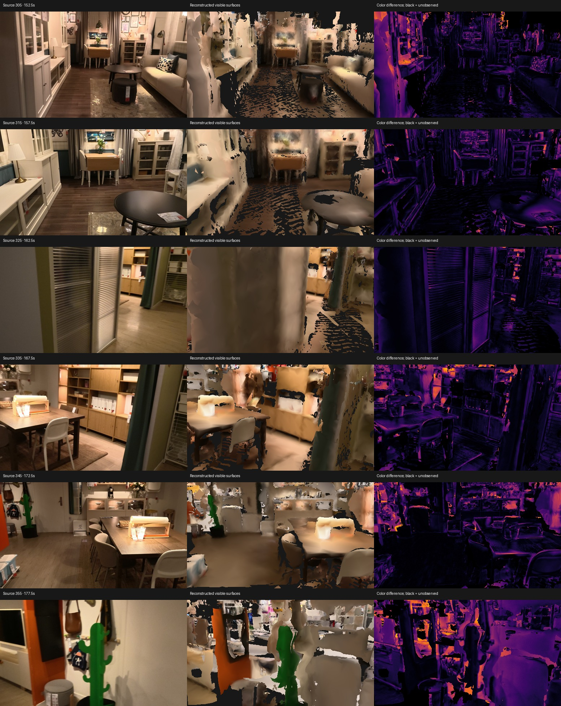
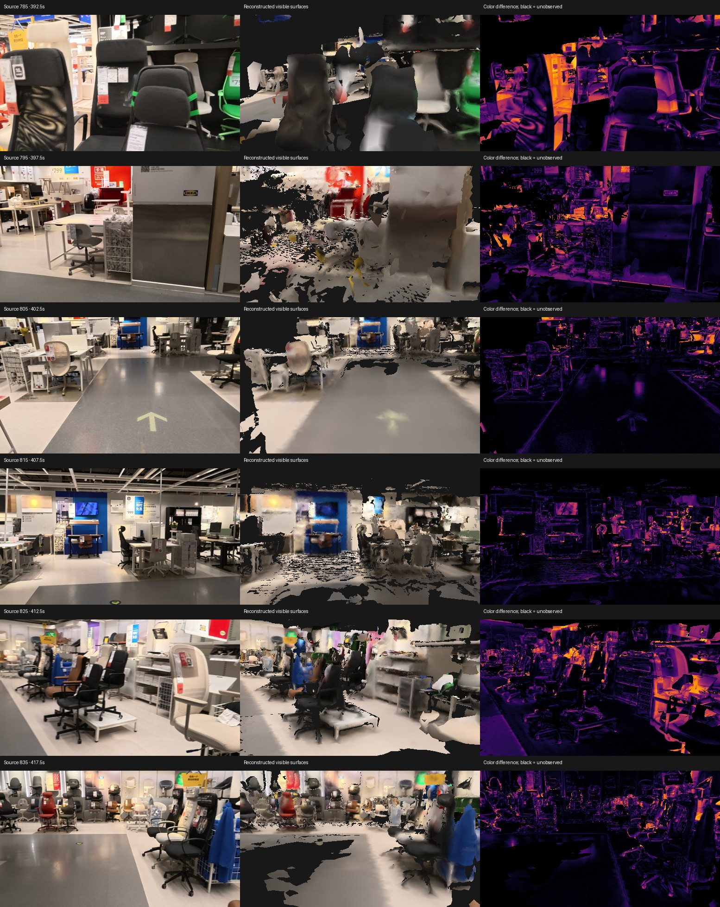
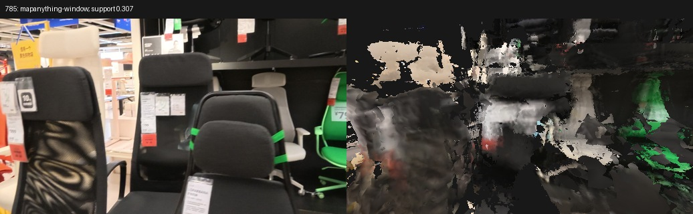

# Native Mac reconstruction experiments

Recorded on 2026-09-09 on an Apple M3 Max with 128 GB of memory.
All measurements below are local runs, not accuracy against a surveyed building.

The input is the official 500-second furniture-store walkthrough `indoor_travel.MP4`.
It is not a supplied residential property scan.
The source SHA-256 is `ca590d8af33c465953d6ed6c305557e4b4d7cc6ba3710b4c65872bbf06b684e0`.
The long checkpoint SHA-256 is `832bc82cbae0bc9bbe946ef5ee1f7226abd8c0e183ccf8beddbb3d133576f409`.

## Current review artifact

The latest complete-scene experiment is `reconstructions/direct-bundle-cauchy-v1/candidate/model/property.glb`.
It improves reserved feature alignment and has five failing app viewpoints out of 100, while its full mesh fails six.
The complete camera-optimization and MapAnything comparisons appear below.
The subsequent [depth-correction and native Brush experiments](photometric-and-brush-results.md) retain three failed depth variants and compare shared Gaussian optimization with an unchanged TSDF.
Brush runs on Metal and improves local reserved-view appearance, while geometric and property-verification checks remain unresolved.
Neither the latest candidate nor the earlier review baseline is verified for property listings.

The hybrid candidate at `reconstructions/indoor-travel-learned-motion10-bootstrap/model/property.glb` is retained for review.
It contains 2,999,999 triangles, occupies 59,950,028 bytes and has SHA-256 `8dc31c39a12669fdd491c968e9208d39659658de6a88bae968735de41eb85d4c`.
The complete 100-view audit gives 69.38% median depth support, with seven views below the 40% screening threshold.
It remains unsuitable for a verified property listing.
The uninterrupted native-stream alternative fails 92 of the same 100 reserved viewpoints and is retained as a failed comparison.

| Exported asset, same 100 reserved views | Hybrid with bootstrap and motion constraints | Uninterrupted native stream |
|---|---:|---:|
| Median visible coverage | 84.41% | 87.14% |
| Median depth support | 69.38% | 8.50% |
| Minimum depth support | 27.44% | 0.0158% |
| Median visible RGB absolute error, 0 to 1 | 0.1053 | 0.2405 |
| Views below 40% depth support | 7 | 92 |
| Fidelity gate | Failed | Failed |

These are internal view-consistency measurements, not geometric accuracy against independent ground truth.
The hybrid comparison includes a failing captured view at frame 355.



## Working pipeline

The implementation performs video extraction, native MPS inference, CPU photogrammetry, depth and motion constrained registration, adaptive dense motion bridges, TSDF fusion, colored GLB export and source-view validation.
No generated walls, room boundaries or hidden object surfaces are inserted.
The source PLY, point cloud, camera records and per-stage diagnostics remain available beside the app asset.
The app asset is a triangle mesh rather than a point-cloud proxy.

The complete CLI passed an 80-frame integration run on the first 40 seconds of the video.
It registered 79 cameras and produced 3,228,363 surface triangles and 299,999 app triangles.
On eight frames withheld from fusion, median mesh coverage was 79.14%, median supported-depth fraction was 84.08%, and median visible RGB absolute error was 0.0629 on a 0-to-1 scale.
Its smallest sampled supported-depth fraction was 69.52%.
This is a limited integration result and does not establish full-building accuracy.

All 1,000 base frames of the full video completed learned inference in 14 overlapping windows.
The corrected implementation also reconstructs dense bursts across fast turns and occlusions.
The refined full camera graph registers all 1,000 base frames after adaptive repair.
The 1,000-camera mesh still fails the stricter fidelity gate.
Its median full-mesh coverage is 86.53%, median supported-depth fraction is 72.87%, and median RGB error is 0.0901.
Frames 515 and 945 have only 37.3% and 20.6% supported depth respectively.
The model is a reviewable research artifact and is not ready for a verified property listing.
Final full-mesh and exported-asset checks are recorded separately in the generated artifact reports.

## Failures that changed the implementation

### Checkpoint pose convention

The tested checkpoint emits decoded camera-to-world poses despite the upstream helper's world-to-camera description.
Both interpretations can pass tensor-shape tests and self-consistent unprojection tests.
On 80 matched photogrammetry cameras, the documented interpretation produced 106.07 degrees median orientation disagreement after a single similarity alignment.
The camera-to-world interpretation reduced that figure to 2.33 degrees.
The adapter now normalizes poses at the inference boundary and requires an explicit convention for unknown checkpoint hashes.

### Metal cache pressure

The first float32 attempt was terminated by signal 9 at frame 44.
A bfloat16 attempt accumulated excessive cached Metal allocations across windows.
Explicitly releasing unused Metal cache allocations after each completed forward pass allowed the full sequence to finish.
In a paired 96-frame comparison, depth, confidence, camera poses and intrinsics were bitwise identical with and without cache release.
The cache-release run used a peak reported Metal driver allocation of 23.79 GB and completed its measured inference section in 99.72 seconds, compared with 181.26 seconds for the earlier run.
These timings are single-run measurements with different memory-pressure histories, not a controlled throughput benchmark.

### Monocular scale collapse

The original global photogrammetry run registered 999 cameras with 0.557 px mean reprojection error.
Nevertheless, its depth scale collapsed across the sequence.
Median calibrated depth fell from about 45 model units in the first inference window to about 0.065 in the last.
Low reprojection error alone did not expose the deformation.

That failed mesh had 88.30% median rendered coverage, but only 1.75% median supported-depth fraction and 0.2138 median RGB error.
Large incorrect planes could cover an image while depicting the wrong geometry.
Coverage is therefore checked together with rendered depth, appearance and the weakest sampled view.

### Disconnected translations and rotations

A depth-only translation experiment achieved 2.96 px median withheld-track reprojection error while its camera graph was disconnected.
Unanchored components overlapped at the origin and produced an invalid scene.
The implementation now explicitly checks graph connectivity and excludes unsupported cameras.

The photogrammetry rotation graph also contained abrupt disagreements with local learned motion at weak connections.
Aligned rotation groups and densely sampled motion bridges resolve these connections using additional source observations.
Every bridge retains its per-step depth-support checks and its scale agreement with an original source frame.

A manually bridged 997-camera model achieved 85.97% median rendered coverage and 72.04% median supported-depth fraction across 24 reserved views.
One late view still had only 25.95% supported depth and a visibly incorrect occluder.
The stricter per-view gate rejects that model despite its acceptable median scores.
The recalibrated run reduces orientation disagreement in that late rotation group from 13.76 degrees to 1.46 degrees at the 95th percentile, but still fails rendering checks at frame 945.
A local-only fusion of frames 936 through 999 also produces the occluder at that viewpoint, with 23.10% supported depth and 0.1826 RGB error.
That falsifies the simple explanation that only distant earlier rooms caused the artifact.
At that stage, local camera/depth inconsistency and reflective-surface error remained competing explanations.

### Paired local camera falsifier

An independent TSDF spike reconstructed the same depth/RGB archives with native local cameras and the registered cameras.
It also compared each full inference window with a 17-frame neighborhood, preserving the every-tenth-frame fusion holdout.
This isolates camera registration from image content and downstream app simplification.

| Reserved frame | Camera source | Window depth support | Neighborhood depth support |
|---|---|---:|---:|
| 945 | Registered | 27.78% | 86.83% |
| 945 | Native local | 88.18% | 88.04% |
| 515 | Registered | 61.96% | 68.11% |
| 515 | Native local | 87.24% | 86.67% |

The native local cameras remove the large incorrect kitchen occluder at frame 945.
The registered full-window arm has 0.1826 visible RGB error, compared with 0.0706 for the native full-window arm.
This is direct evidence that registration introduces the observed local failure; it does not establish which individual intrinsic, rotation or translation error contributes most.
The spike uses windows starting at 936 and 504, so its percentages are not directly interchangeable with the earlier complete-scene metrics.

An experimental `--camera-source learned` path now preserves learned camera intrinsics and aligned learned orientations while retaining photogrammetry tracks and the robust translation graph.
It registers all 1,000 base cameras with 3.56 px median withheld-track reprojection error.
The full-mesh experiment reached 74.74% median supported depth but only 19.34% minimum supported depth.
Its exported asset reached 71.88% median and 20.68% minimum supported depth.
It fails the same gate and is not adopted as the default.
Preserving intrinsics and orientations alone does not preserve the native local reconstruction when the global translation solver changes camera positions.
The reproducible paired experiment is `experiments/local_pose_falsifier.py`.

Repeating that test on the actual owning windows reveals an additional failure in prediction selection.
At frame 515, native fusion using window 432 has only 27.36% supported depth, compared with 87.24% using window 504.
At frame 945, native window 864 has 66.69% support, compared with 88.18% using window 936.
Thus registration is not the sole source of error across all windows.
An eight-frame bootstrap policy now selects newer predictions consistently in the experimental learned-camera path.

The motion-weight experiment holds images, depths and orientations fixed while changing the influence of depth-supported local motion in the translation graph.
For the late window, multiplying motion weights by ten increases local support from 24.21% to 85.33%, with withheld-track median reprojection error changing from 3.56 px to 3.71 px.
Much larger weights increase track error and do not improve that local view.
This motivates a bounded alternative rather than a general claim that more motion weight is always better.
The complete bootstrap-and-motion candidate is recorded separately and must pass full-scene rendering checks.

That candidate completed reconstruction and validation on all 100 reserved views.
Its full mesh contains 38,423,421 triangles; its app GLB contains 2,999,999 triangles and occupies 59,950,028 bytes.
The kitchen view at frame 945 reaches 73.65% supported depth in the full mesh and 70.38% in the app asset, resolving the previous large occluder.
However, the expanded audit still rejects four full-mesh views and seven app views.
The app failures occur at frames 355, 515, 535, 665, 755, 785 and 795.
Across all 100 app views, median coverage is 84.41%, median supported depth is 69.38%, minimum supported depth is 27.44%, and median RGB error is 0.1053.
These 100-view aggregates are not directly comparable with the earlier 24-view aggregates.
The candidate remains a research artifact and does not pass the listing gate.

The individual measurements and paired local comparisons are preserved in [fidelity-spikes.json](evidence/fidelity-spikes.json).
The native local comparison below removes the registered-camera occluder, illustrating the local-versus-global diagnostic without implying that the complete scene is correct.


The failed registered-camera arm is preserved as a [separate comparison](evidence/kitchen-registered-window.jpg).

### Uninterrupted native checkpoint comparison

The Mac also completed all 1,000 frames in one native LingBot inference window, retaining eight scale frames and a 64-frame attention cache.
This avoids both external photogrammetry and joins between separately initialized prediction windows.
Inference and archive writing took 1,506.74 seconds, excluding model loading and input preprocessing.
Peak reported live Metal allocation was 14.77 GB, and peak reported driver allocation was 23.76 GB.
These are overlapping allocator measurements rather than quantities to add together.

Depth, confidence, extrinsics, intrinsics and RGB for the first 96 frames are bitwise identical to the earlier normalized 96-frame baseline.
The larger run therefore preserves that initial baseline while extending its uninterrupted history.
The archive is retained at `reconstructions/indoor-travel-native-stream1000/windows/000000.npz` with SHA-256 `2125db6b5f554352ae3c61fc601e9b9d94d285bc0a3d7ea36eb16e59ce2ac430`.
Its full mesh and actual exported asset were evaluated on all 100 reserved views.
The full mesh contains 22,341,060 triangles and achieves only 8.86% median supported depth, despite 89.18% median coverage.
The three-million-triangle GLB occupies 65,217,288 bytes and achieves 8.50% median supported depth with 0.2405 median RGB error.
It fails the minimum-view depth check in 92 of 100 reserved views.
The exported GLB SHA-256 is `bf4e421ccb457b10ab9e639e380731891ba399b740f7b01b9addb5422a853cd5`.
Fusion and export took 231.87 seconds, excluding subsequent validation.
Resuming through the complete `run --camera-source native --window 1000` CLI reused the saved computation and returned exit status 2 with `status: needs_review`.
This result shows that removing external registration and window joins alone does not resolve full-scene inconsistency in this capture.
It does not isolate the remaining causes between model predictions and global fusion conflicts.
The [native comparison image](evidence/native-stream-app-comparison.jpg) preserves the observed failure.

### Exact adaptive sampling

An initial burst-extraction command omitted variable-frame-rate output mode and produced duplicate output frames.
A comparison against original source images exposed the timestamp mismatch.
The corrected command uses `-fps_mode vfr` and preserves original anchor images unchanged.
All ten independently decoded anchor images in the 319-to-320 bridge extraction check were pixel-identical to their original 2 fps counterparts.

### Export appearance

Captured colors already contain the scene's illumination.
Applying another set of viewer lights amplified surface noise into visible faceting.
The GLB now explicitly uses the unlit material extension.
The viewer serves original GLB bytes because a Trimesh parse/export cycle can discard vertex colors when an untextured material is present.
Validation separately loads vertex colors and checks the actual GLB geometry against reserved source views.
The initial fixed 300,000-triangle target also removed substantial visible coverage from the full scene.
The export now performs resolution-bounded vertex clustering and uses a scene-length-dependent triangle budget.
A three-million-triangle detailed asset is retained beside the coarse comparison asset for the full walkthrough.
The final detailed GLB is 60,202,580 bytes and contains 2,999,999 triangles.
Across the 24 inspected views, it preserves 84.23% median coverage and 71.72% median supported depth, with 0.0965 median RGB error.
Its minimum supported depth is 21.51%, so it still fails the fidelity gate.
The final 80-frame app asset passes the same screening checks with 77.42% median coverage, 83.33% median supported depth and 68.55% minimum supported depth.

The complete measurement snapshots are in [measurements.json](evidence/measurements.json).
The image below includes the unresolved late-view failure rather than showing only successful viewpoints.


The shorter integration example is available as a [separate comparison](evidence/sample-app-comparison.jpg).

## Optional UV baking experiment

`experiments/texture_bake.py` retains a source-color baking experiment using xatlas and closest-point queries against the full observed mesh.
On the fragmented 300,000-triangle sample, the default chart calculation had not completed after 20 minutes.
A bounded-chart variant also had not completed after seven minutes.
Both experiments were stopped after verifying that the source meshes were saved and no texture output existed.
They are excluded from the working pipeline and are not claimed as completed texture results.

## Apple Object Capture comparison

[Apple's Object Capture API](https://developer.apple.com/videos/play/wwdc2021/10076/) provides native Mac photogrammetry for real-world objects.
The standalone Swift program in `experiments/apple_photogrammetry.swift` compiles against the installed macOS SDK, and `PhotogrammetrySession.isSupported` returns true on this Mac.
Two runs on the same 80 extracted 1280-by-720 frames failed with `processError`; neither produced a USDZ model.
Both used sequential image ordering, high feature sensitivity, medium output detail and disabled object masking.
The system log reported CorePG error -15.
It initially reported an unavailable LearnedMVS asset, then successful access to that asset; the final internal error messages were private.
The root cause remains undetermined, so these failures do not establish that Apple photogrammetry cannot reconstruct this scene.
This comparison is separate from the working mesh pipeline.

## Remaining acceptance requirements

### Additional failure isolation

The independent local reconstruction comparison now covers all seven failing exported views and the corrected kitchen view as a control.
The 32 saved comparisons are in `reconstructions/remaining-views-falsifier-v1/results.jsonl` and the generated [experiment snapshot](evidence/fidelity-spikes.json).
The registered full-window arms include unowned overlap predictions, so they isolate local behavior and do not replace the complete production-fusion audit.

Frame 355 reaches 84.03% supported depth with 16 nearby native frames, but only 41.17% when fusing its full native window.
Frame 795 similarly reaches 80.73% with nearby registered frames versus 33.85% across its full registered window.
Frame 755 reaches 73.74% in the registered local-window comparison, while the complete exported scene reaches 36.45%.
These comparisons show that adding views can introduce incompatible foreground surfaces.
They do not establish that the locally consistent camera motion is correct.

A fresh 48-frame context covering original frames 760 through 807 raises frame 785's full-window depth support from 25.24% to 41.12%.
Repeating the same fresh context in float32 reaches 42.82%, with visible chair distortion still present.
The float32 run completes with the corrected Metal cache handling; peak reported driver allocation is 21.61 GB.
Inference and archive writing take 35.84 seconds for bfloat16 and 42.96 seconds for float32, excluding model loading and preprocessing.
These are one run per precision, not a controlled throughput benchmark.
The bfloat16 archive SHA-256 is `2293136210c2b77eabd4e093517d17f8475b2deddfd34bced376131058207d53`.
The float32 archive SHA-256 is `c09121bb5a92ee0b0af95961a2e2eefd40302d05cf0fc9183c0e6a5b7d4f6a7f`.

The new `experiments/visibility_carving_falsifier.py` tests whether repeated free-space evidence can remove the incorrect occluders.
It excludes reserved frames from both direct votes and neighboring-depth support, uses the top confidence quartile, requires three temporal bins of contradictory evidence, and preserves three fixed removal policies separately.
All 900 training views contribute before the exported arms are evaluated on the same 100 reserved views as the unchanged baseline.
The policies remove 724, 815 and 831 triangles out of 2,999,999, and none resolves any of the seven failing views.
The conservative policy leaves median depth support unchanged at 69.38%.
This experiment is retained under `reconstructions/visibility-carving-v1/` and is not promoted into the main pipeline.

The new `experiments/pair_pose_falsifier.py` compares unchanged registered poses, unchanged native poses, robust rigid fitting and similarity fitting on actual COLMAP feature correspondences.
One fifth of feature tracks are reserved from each fit.
The rigid and similarity solvers recover known synthetic transforms with 20% outliers in a separate numerical check.
At frame 755's neighboring camera pair, rigid fitting lowers median reserved feature error from 5.81 to 1.34 pixels over ten reserved matches at the processed image resolution.
At frame 515's pair, it lowers error from 1.54 to 0.83 pixels over 19 reserved matches.
At frame 355's pair, the native poses have 20.30 pixels median error over nine reserved matches despite their high local depth support; the registered poses have 1.21 pixels error.
This is a concrete counterexample to treating agreement with predicted depth as proof of correct camera motion.
Frame 785 has insufficient reserved feature tracks for this paired comparison.
The camera-pair results motivated the complete-scene camera experiments below.
They did not themselves prove a corrected full-scene model.

### Complete-scene camera optimization

`experiments/joint_pose_graph.py` builds an SE3 pose graph for all 1,000 cameras from depth-backed feature correspondences.
It fits 4,467 camera pairs and accepts 3,419 feature edges, with weak existing-motion priors keeping the graph connected.
The transform convention and information matrices are verified against [Open3D's pose-graph formulation](https://www.open3d.org/docs/release/tutorial/pipelines/multiway_registration.html) and a synthetic camera graph.
This first graph worsens reserved feature alignment and increases exported-view failures from seven to twelve.
Its complete output is retained in `reconstructions/joint-pose-graph-v1/`.

`experiments/direct_bundle_refinement.py` instead jointly optimizes camera rotations, camera centers, 90,591 shared landmarks and per-frame depth scales against 466,983 training feature observations.
Camera zero anchors the coordinate system; reserved feature tracks do not contribute to the objective or its normalization.
Each outer optimization step saves a resumable parameter checkpoint and appends its trace.
The implementation runs on MPS and reconstructs and validates both complete output meshes after optimization.

The pseudo-Huber version lowers median reserved feature error but worsens its tail and increases app failures to eight.
An objective audit finds that the worst 1% of training matches contributes 75.97% of its pixel loss.
The Cauchy variant reduces those outliers' influence while preserving the same near-zero curvature and all reserved checks.
Absolute training objectives from these two loss functions are not comparable quality scores.

| Complete-scene variant | Reserved feature error, median / 95th percentile, pixels | App median depth support | App median RGB error | App failures / 100 |
|---|---:|---:|---:|---:|
| Unchanged registered baseline | 1.614 / 8.430 | 69.38% | 0.1053 | 7 |
| SE3 pose graph | 1.785 / 11.769 | 62.28% | 0.1154 | 12 |
| Direct bundle, pseudo-Huber | 0.975 / 10.037 | 68.64% | 0.1054 | 8 |
| Direct bundle, Cauchy | 0.576 / 4.034 | 70.82% | 0.1017 | 5 |

Feature statistics cover 122,264 reserved correspondences at the processed image resolution.
All rows use the same original video and all 100 reserved rendering viewpoints, but optimized poses and depth scales change each candidate's rendering references.
These are development comparisons, not independent measurements of building accuracy.
The Cauchy model's app failures are frames 355, 515, 665, 785 and 795.
Its full mesh fails six views: 355, 515, 665, 755, 785 and 795.
Its improved median statistics therefore do not establish uniformly improved or faithful geometry.

The Cauchy full mesh has 39,018,464 triangles; its GLB has 3,000,000 triangles and SHA-256 `b92b7c0f5e7714c32a4a979bb03024081cb241ac4ee09fbe47e7963a50282f53`.
Fusion and export take 417.74 seconds in this run, excluding model inference, optimization and rendering validation.
The complete candidate is `reconstructions/direct-bundle-cauchy-v1/candidate/`.
Visual inspection still shows warped chair backs and missing nearby surfaces.



### MapAnything on the Mac

[MapAnything](https://github.com/facebookresearch/map-anything) accepts images and optional calibration, poses or depth, making it relevant both as an alternative depth model and as a geometry-conditioned reconstruction component.
The repository recommends its [Apache model](https://huggingface.co/facebook/map-anything-apache) for commercial applications; this experiment uses that checkpoint, rather than the noncommercial research weights.
The local source checkout is commit `3d10cf7a3016fc0f9bb13a071ee66c47b10be0d9`, with UniCeption 0.1.7, PyTorch 2.13.0 and torchvision 0.28.0 in `.venv-mapanything`.
Checkpoint revision `00f9c245bbcb60522d1ed7f9e9d88462c6e3f38a` contains a 4,914,062,480-byte weights file, verified as SHA-256 `fa06c0fdccefc5048e072c85935d5789b1e36b307f3859033c17f9dcb9fd5201`.
The model files were obtained through Motrix with a pinned revision and checksum.

`experiments/mapanything_mac.py` loads the complete local checkpoint strictly and redirects its DINO architecture lookup to local checkout `7764ea0f912e53c92e82eb78a2a1631e92725fc8`.
It rejects backbone-weight downloads, records source-frame hashes, checks the predicted C2W convention against native world points, and exports the existing pipeline's depth/K/W2C archive format.
The first two-frame GPU inference completed, but publication exposed an adapter assumption: raw inference returns `non_ambiguous_mask`, while the combined `mask` field exists only when output masking is requested.
The adapter now uses the raw non-ambiguous mask and leaves edge/support filtering to the reconstruction pipeline.
Four focused tests cover camera-coordinate conversion, rejection of incorrect pose conventions, prevention of redundant backbone downloads and matched image/calibration/pose conditioning.

The repeated two-frame check on original frames 785 and 786 completes in float32 on MPS, with 1.04 seconds measured for inference and 5.50 GB reported driver allocation after inference.
This is a warm two-frame compatibility check, not a throughput benchmark or full-scene accuracy result.
The 99th-percentile relative difference between the fitted pinhole representation and native camera points is 1.63%; native C2W reconstruction agrees with native world points to about 2.4e-7 relative error at the 99th percentile.
The pinhole approximation must therefore remain visible in subsequent comparisons.
The 48-frame chair-section experiment uses the same original frames 760 through 807 as the Lingbot precision comparison.
It completes in 29.95 seconds of inference, with 10.69 GB driver allocation reported afterward; this is not a measured peak.
Its camera-to-world normalization agrees with the native world points, while fitted-pinhole error reaches 3.31% of depth at the 99th percentile.
The initial full-fusion attempt rejects the adapter's zero-overlap metadata before producing a mesh.
The adapter now writes a valid overlap, and all subsequent 48-frame variants complete fusion, GLB export and five-view validation.

Three controlled variants reuse the exact registered owning-window RGB: images alone, images plus calibration, and images plus calibration and nonmetric camera poses.
Source-window hashes identify which RGB, K and pose produced every conditioned input.
Supplying camera geometry conditions MapAnything's predictions; the inspected implementation still predicts its output ray fields and camera poses rather than copying the supplied values.
A fourth experiment, `experiments/mapanything_fixed_camera_falsifier.py`, explicitly retains registered K and poses and estimates one depth scale from 43 training camera centers, reserving five cameras from the scale fit.
That scale fit is poor: its median reserved center residual is 38.86% of median scaled depth.
The resulting failed reconstruction is retained as a counterexample to replacing camera poses through a single trajectory scale.

| Same 48-frame section | Frame 775 depth support | Frame 785 depth support | Frame 795 depth support |
|---|---:|---:|---:|
| Unchanged fresh-context Lingbot, float32 | 69.46% | 42.82% | 52.69% |
| MapAnything, same RGB only | 61.80% | 23.42% | 58.10% |
| MapAnything with calibration | 62.92% | 30.66% | 69.36% |
| MapAnything with calibration and poses | 54.80% | 10.31% | 47.29% |
| MapAnything calibration depth, fixed registered cameras | 14.86% | 7.49% | 30.02% |

These local rows fuse all 43 nonreserved frames and compare each model against its own predicted depth, so cross-model depth-support differences are not ground-truth accuracy scores.
The captured-image comparisons also remain necessary.
MapAnything improves frame 795 in the calibration arm but retains substantial chair distortion at frame 785.
All four MapAnything full and exported meshes fail the same screening requirements; this is not a successful replacement model.
The images-only and calibration app meshes each fail frames 785 and 805; the pose-conditioned app mesh fails frames 765 and 785.
The original five reserved viewpoints are 765, 775, 785, 795 and 805.



Reproduce the calibration-conditioned inference with:

```sh
.venv-mapanything/bin/python -m artifacts.research.experiments.mapanything_mac \
  --source reconstructions/indoor-travel-learned-motion10-bootstrap \
  --processed-source reconstructions/direct-bundle-cauchy-v1/candidate \
  --conditioning calibration --start 760 --count 48 \
  --weights checkpoints/map-anything-apache/00f9c245bbcb60522d1ed7f9e9d88462c6e3f38a \
  --dino-repository /Users/zeeshanhaque/Projects/dinov2 \
  --output reconstructions/mapanything-calibration-760
```

The completed-run check validates the saved archive hash and reuses it.
Fusion and source/app validation use the existing `lingbot_map.reconstruction.fusion.fuse` and `lingbot_map.reconstruction.validation.validate` functions in `.venv-reconstruction`.
The complete experiment snapshots, including failures and checkpoint hashes, are in [fidelity-spikes.json](evidence/fidelity-spikes.json).
The subsequent direct multiview experiments retain fixed cameras and explicit occlusion handling, but lose surface coverage and fail screening.
Their results and the native Brush comparison are recorded in [the next experiment report](photometric-and-brush-results.md).

The current validation images are withheld from fusion, but still participate in learned inference or photogrammetry.
The feature-track split is also a development check, not independently surveyed ground truth.
Thresholds were chosen as engineering screening defaults and are not calibrated guarantees of centimeter accuracy.

A property listing requires the actual property's capture, a measured scale anchor, independent held-out lengths, room-connectivity review and inspection of missing walls, doors, windows and ceilings.
Mirrors, glass, people and unobserved surfaces remain uncertain.
The reports deliberately retain `ready_for_verified_property_listing: false` while these checks are absent.

Lucida, ShapeR and other object-model candidates are evaluated separately in [the research continuation](lucida-and-object-reconstruction.md).
The user-supplied FixAnything repository is evaluated in [its own assessment](fixanything-assessment.md).
