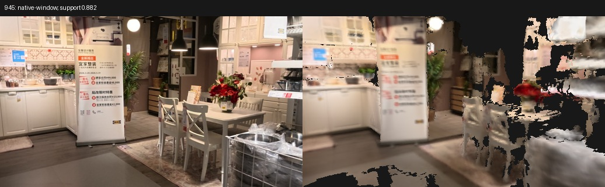
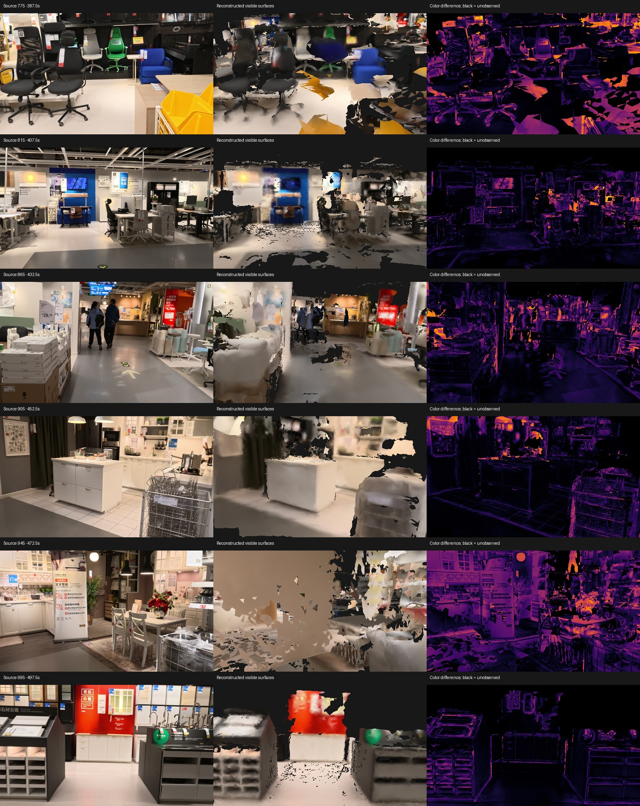

# Native Mac reconstruction experiments

Recorded on 2026-09-09 on an Apple M3 Max with 128 GB of memory.
All measurements below are local runs, not accuracy against a surveyed building.

The input is the official 500-second furniture-store walkthrough `indoor_travel.MP4`.
It is not a supplied residential property scan.
The source SHA-256 is `ca590d8af33c465953d6ed6c305557e4b4d7cc6ba3710b4c65872bbf06b684e0`.
The long checkpoint SHA-256 is `832bc82cbae0bc9bbe946ef5ee1f7226abd8c0e183ccf8beddbb3d133576f409`.

## Working pipeline

The implementation performs video extraction, native MPS inference, CPU photogrammetry, depth and motion constrained registration, adaptive dense motion bridges, TSDF fusion, colored GLB export and source-view validation.
No generated walls, room boundaries or hidden object surfaces are inserted.
The source PLY, point cloud, camera records and per-stage diagnostics remain available beside the app asset.
The app asset is a triangle mesh rather than a point-cloud proxy.

The complete CLI passed an 80-frame integration run on the first 40 seconds of the video.
It registered 79 cameras and produced 3,228,363 surface triangles and 299,999 app triangles.
On eight frames withheld from fusion, median mesh coverage was 79.14%, median supported-depth fraction was 84.08%, and median visible RGB absolute error was 0.0629 on a 0-to-1 scale.
Its smallest sampled supported-depth fraction was 69.52%.
This is a limited integration result and does not establish full-building accuracy.

All 1,000 base frames of the full video completed learned inference in 14 overlapping windows.
The corrected implementation also reconstructs dense bursts across fast turns and occlusions.
The refined full camera graph registers all 1,000 base frames after adaptive repair.
The 1,000-camera mesh still fails the stricter fidelity gate.
Its median full-mesh coverage is 86.53%, median supported-depth fraction is 72.87%, and median RGB error is 0.0901.
Frames 515 and 945 have only 37.3% and 20.6% supported depth respectively.
The model is a reviewable research artifact and is not ready for a verified property listing.
Final full-mesh and exported-asset checks are recorded separately in the generated artifact reports.

## Failures that changed the implementation

### Checkpoint pose convention

The tested checkpoint emits decoded camera-to-world poses despite the upstream helper's world-to-camera description.
Both interpretations can pass tensor-shape tests and self-consistent unprojection tests.
On 80 matched photogrammetry cameras, the documented interpretation produced 106.07 degrees median orientation disagreement after a single similarity alignment.
The camera-to-world interpretation reduced that figure to 2.33 degrees.
The adapter now normalizes poses at the inference boundary and requires an explicit convention for unknown checkpoint hashes.

### Metal cache pressure

The first float32 attempt was terminated by signal 9 at frame 44.
A bfloat16 attempt accumulated excessive cached Metal allocations across windows.
Explicitly releasing unused Metal cache allocations after each completed forward pass allowed the full sequence to finish.
In a paired 96-frame comparison, depth, confidence, camera poses and intrinsics were bitwise identical with and without cache release.
The cache-release run used a peak reported Metal driver allocation of 23.79 GB and completed its measured inference section in 99.72 seconds, compared with 181.26 seconds for the earlier run.
These timings are single-run measurements with different memory-pressure histories, not a controlled throughput benchmark.

### Monocular scale collapse

The original global photogrammetry run registered 999 cameras with 0.557 px mean reprojection error.
Nevertheless, its depth scale collapsed across the sequence.
Median calibrated depth fell from about 45 model units in the first inference window to about 0.065 in the last.
Low reprojection error alone did not expose the deformation.

That failed mesh had 88.30% median rendered coverage, but only 1.75% median supported-depth fraction and 0.2138 median RGB error.
Large incorrect planes could cover an image while depicting the wrong geometry.
Coverage is therefore checked together with rendered depth, appearance and the weakest sampled view.

### Disconnected translations and rotations

A depth-only translation experiment achieved 2.96 px median withheld-track reprojection error while its camera graph was disconnected.
Unanchored components overlapped at the origin and produced an invalid scene.
The implementation now explicitly checks graph connectivity and excludes unsupported cameras.

The photogrammetry rotation graph also contained abrupt disagreements with local learned motion at weak connections.
Aligned rotation groups and densely sampled motion bridges resolve these connections using additional source observations.
Every bridge retains its per-step depth-support checks and its scale agreement with an original source frame.

A manually bridged 997-camera model achieved 85.97% median rendered coverage and 72.04% median supported-depth fraction across 24 reserved views.
One late view still had only 25.95% supported depth and a visibly incorrect occluder.
The stricter per-view gate rejects that model despite its acceptable median scores.
The recalibrated run reduces orientation disagreement in that late rotation group from 13.76 degrees to 1.46 degrees at the 95th percentile, but still fails rendering checks at frame 945.
A local-only fusion of frames 936 through 999 also produces the occluder at that viewpoint, with 23.10% supported depth and 0.1826 RGB error.
That falsifies the simple explanation that only distant earlier rooms caused the artifact.
At that stage, local camera/depth inconsistency and reflective-surface error remained competing explanations.

### Paired local camera falsifier

An independent TSDF spike reconstructed the same depth/RGB archives with native local cameras and the registered cameras.
It also compared each full inference window with a 17-frame neighborhood, preserving the every-tenth-frame fusion holdout.
This isolates camera registration from image content and downstream app simplification.

| Reserved frame | Camera source | Window depth support | Neighborhood depth support |
|---|---|---:|---:|
| 945 | Registered | 27.78% | 86.83% |
| 945 | Native local | 88.18% | 88.04% |
| 515 | Registered | 61.96% | 68.11% |
| 515 | Native local | 87.24% | 86.67% |

The native local cameras remove the large incorrect kitchen occluder at frame 945.
The registered full-window arm has 0.1826 visible RGB error, compared with 0.0706 for the native full-window arm.
This is direct evidence that registration introduces the observed local failure; it does not establish which individual intrinsic, rotation or translation error contributes most.
The spike uses windows starting at 936 and 504, so its percentages are not directly interchangeable with the earlier complete-scene metrics.

An experimental `--camera-source learned` path now preserves learned camera intrinsics and aligned learned orientations while retaining photogrammetry tracks and the robust translation graph.
It registers all 1,000 base cameras with 3.56 px median withheld-track reprojection error.
The full-mesh experiment reached 74.74% median supported depth but only 19.34% minimum supported depth.
Its exported asset reached 71.88% median and 20.68% minimum supported depth.
It fails the same gate and is not adopted as the default.
Preserving intrinsics and orientations alone does not preserve the native local reconstruction when the global translation solver changes camera positions.
The reproducible paired experiment is `experiments/local_pose_falsifier.py`.

Repeating that test on the actual owning windows reveals an additional failure in prediction selection.
At frame 515, native fusion using window 432 has only 27.36% supported depth, compared with 87.24% using window 504.
At frame 945, native window 864 has 66.69% support, compared with 88.18% using window 936.
Thus registration is not the sole source of error across all windows.
An eight-frame bootstrap policy now selects newer predictions consistently in the experimental learned-camera path.

The motion-weight experiment holds images, depths and orientations fixed while changing the influence of depth-supported local motion in the translation graph.
For the late window, multiplying motion weights by ten increases local support from 24.21% to 85.33%, with withheld-track median reprojection error changing from 3.56 px to 3.71 px.
Much larger weights increase track error and do not improve that local view.
This motivates a bounded alternative rather than a general claim that more motion weight is always better.
The complete bootstrap-and-motion candidate is recorded separately and must pass full-scene rendering checks.

That candidate completed reconstruction and validation on all 100 reserved views.
Its full mesh contains 38,423,421 triangles; its app GLB contains 2,999,999 triangles and occupies 59,950,028 bytes.
The kitchen view at frame 945 reaches 73.65% supported depth in the full mesh and 70.38% in the app asset, resolving the previous large occluder.
However, the expanded audit still rejects four full-mesh views and seven app views.
The app failures occur at frames 355, 515, 535, 665, 755, 785 and 795.
Across all 100 app views, median coverage is 84.41%, median supported depth is 69.38%, minimum supported depth is 27.44%, and median RGB error is 0.1053.
These 100-view aggregates are not directly comparable with the earlier 24-view aggregates.
The candidate remains a research artifact and does not pass the listing gate.

The individual measurements and paired local comparisons are preserved in [fidelity-spikes.json](evidence/fidelity-spikes.json).
The native local comparison below removes the registered-camera occluder, illustrating the local-versus-global diagnostic without implying that the complete scene is correct.

The failed registered-camera arm is preserved as a [separate comparison](evidence/kitchen-registered-window.jpg).

### Uninterrupted native checkpoint comparison

The Mac also completed all 1,000 frames in one native LingBot inference window, retaining eight scale frames and a 64-frame attention cache.
This avoids both external photogrammetry and joins between separately initialized prediction windows.
Inference and archive writing took 1,506.74 seconds, excluding model loading and input preprocessing.
Peak reported live Metal allocation was 14.77 GB, and peak reported driver allocation was 23.76 GB.
These are overlapping allocator measurements rather than quantities to add together.

Depth, confidence, extrinsics, intrinsics and RGB for the first 96 frames are bitwise identical to the earlier normalized 96-frame baseline.
The larger run therefore preserves that initial baseline while extending its uninterrupted history.
The archive is retained at `reconstructions/indoor-travel-native-stream1000/windows/000000.npz` with SHA-256 `2125db6b5f554352ae3c61fc601e9b9d94d285bc0a3d7ea36eb16e59ce2ac430`.
Its full mesh and actual exported asset are evaluated on all 100 reserved views.

### Exact adaptive sampling

An initial burst-extraction command omitted variable-frame-rate output mode and produced duplicate output frames.
A comparison against original source images exposed the timestamp mismatch.
The corrected command uses `-fps_mode vfr` and preserves original anchor images unchanged.
All ten independently decoded anchor images in the 319-to-320 bridge extraction check were pixel-identical to their original 2 fps counterparts.

### Export appearance

Captured colors already contain the scene's illumination.
Applying another set of viewer lights amplified surface noise into visible faceting.
The GLB now explicitly uses the unlit material extension.
The viewer serves original GLB bytes because a Trimesh parse/export cycle can discard vertex colors when an untextured material is present.
Validation separately loads vertex colors and checks the actual GLB geometry against reserved source views.
The initial fixed 300,000-triangle target also removed substantial visible coverage from the full scene.
The export now performs resolution-bounded vertex clustering and uses a scene-length-dependent triangle budget.
A three-million-triangle detailed asset is retained beside the coarse comparison asset for the full walkthrough.
The final detailed GLB is 60,202,580 bytes and contains 2,999,999 triangles.
Across the 24 inspected views, it preserves 84.23% median coverage and 71.72% median supported depth, with 0.0965 median RGB error.
Its minimum supported depth is 21.51%, so it still fails the fidelity gate.
The final 80-frame app asset passes the same screening checks with 77.42% median coverage, 83.33% median supported depth and 68.55% minimum supported depth.

The complete measurement snapshots are in [measurements.json](evidence/measurements.json).
The image below includes the unresolved late-view failure rather than showing only successful viewpoints.

The shorter integration example is available as a [separate comparison](evidence/sample-app-comparison.jpg).

## Optional UV baking experiment

`experiments/texture_bake.py` retains a source-color baking experiment using xatlas and closest-point queries against the full observed mesh.
On the fragmented 300,000-triangle sample, the default chart calculation had not completed after 20 minutes.
A bounded-chart variant also had not completed after seven minutes.
Both experiments were stopped after verifying that the source meshes were saved and no texture output existed.
They are excluded from the working pipeline and are not claimed as completed texture results.

## Apple Object Capture comparison

[Apple's Object Capture API](https://developer.apple.com/videos/play/wwdc2021/10076/) provides native Mac photogrammetry for real-world objects.
The standalone Swift program in `experiments/apple_photogrammetry.swift` compiles against the installed macOS SDK, and `PhotogrammetrySession.isSupported` returns true on this Mac.
Two runs on the same 80 extracted 1280-by-720 frames failed with `processError`; neither produced a USDZ model.
Both used sequential image ordering, high feature sensitivity, medium output detail and disabled object masking.
The system log reported CorePG error -15.
It initially reported an unavailable LearnedMVS asset, then successful access to that asset; the final internal error messages were private.
The root cause remains undetermined, so these failures do not establish that Apple photogrammetry cannot reconstruct this scene.
This comparison is separate from the working mesh pipeline.

## Remaining acceptance requirements

The current validation images are withheld from fusion, but still participate in learned inference or photogrammetry.
The feature-track split is also a development check, not independently surveyed ground truth.
Thresholds were chosen as engineering screening defaults and are not calibrated guarantees of centimeter accuracy.

A property listing requires the actual property's capture, a measured scale anchor, independent held-out lengths, room-connectivity review and inspection of missing walls, doors, windows and ceilings.
Mirrors, glass, people and unobserved surfaces remain uncertain.
The reports deliberately retain `ready_for_verified_property_listing: false` while these checks are absent.

Lucida, ShapeR and other object-model candidates are evaluated separately in [the research continuation](lucida-and-object-reconstruction.md).
The user-supplied FixAnything repository is evaluated in [its own assessment](fixanything-assessment.md).
