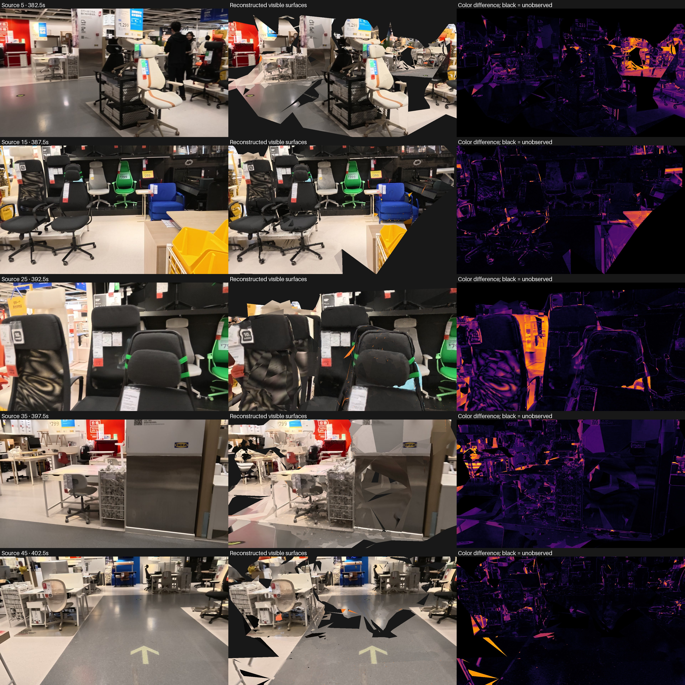

# Native CPU multiview reconstruction on the Mac

Recorded on 2026-09-09 on the M3 Max.
OpenMVS now runs locally from captured photographs through dense points, a triangle mesh, texturing and a standalone GLB.
The completed 24-second chair-section trial remains an unverified research artifact with missing surfaces and geometric disagreements.
It does not establish a faithful complete building.

## Verified release and input

The official [OpenMVS v2.4.0 release](https://github.com/cdcseacave/openMVS/releases/tag/v2.4.0) provides `OpenMVS_macOS_arm64.zip`.
Motrix downloads the 68,347,008-byte archive directly into the local reconstruction tools directory.
Its SHA-256 matches the release asset digest: `3d4c616c97031b1ab6e2eecb0ddd5614fb99513c0782a32c9350602faf38799b`.
`file` identifies the executables as Mach-O arm64, and their runtime logs identify Darwin arm64 and the Apple M3 Max.
The banner's generic “x64” wording is not the executable architecture.
The inspected source is pinned to v2.4.0 in `~/Projects/openMVS`.
OpenMVS uses the [GNU Affero General Public License v3](https://github.com/cdcseacave/openMVS/blob/v2.4.0/LICENSE); this experiment invokes separate local executables and does not vendor that implementation into the Apache-licensed Python code.

The dataset uses the same 43 training and five reserved images as the [higher-resolution Gaussian experiment](gaussian-surface-results.md).
Images retain 1280-by-720 captured pixels, COLMAP calibration and camera poses.
The exporter verifies source hashes, rejects reserved training images and round-trips every exported camera and sparse track association.
It retains 9,661 sparse points observed in at least two training images, with source point reprojection error at most two pixels.
This count differs from the Brush seed because the OpenMVS exporter applies its own documented track and image-boundary selection.
Camera estimation previously used reserved images, so this remains a development consistency check rather than an independent survey benchmark.

## Dense reconstruction and mesh handoff

The CPU trial uses eight threads, 1280-pixel images, five neighboring views, two geometric-consistency iterations and at least two agreeing views during depth fusion.
Automatic ROI cropping and artificial tower points are disabled.
The runtime reports 41 fused depth maps from the 43 input images and exports 377,940 dense points.
The recorded dense stage takes 116.29 seconds in this single run.
The pipeline retains depth maps, command arguments, process IDs, logs, completion records and artifact hashes.

Two importer details required actual end-to-end fixes.
`InterfaceCOLMAP` expects the dataset root containing `sparse/`, not the sparse directory itself.
An MVS interface file does not behave like the native compressed scene format during subsequent meshing.
With compressed output selected, meshing does not automatically load the neighboring dense PLY.

A standalone two-arm experiment uses identical `dense.mvs` and `dense.ply` files.
Implicit point input consumes 9,661 sparse points and produces 8,407 triangles.
Explicit `--pointcloud-file dense.ply` consumes all 377,940 dense points and produces 472,011 triangles.
The native log records the consumed point count before triangulation.
The corrected pipeline always supplies the dense PLY explicitly and uses compressed scene archives for mesh and texture stages.
Earlier attempts remain preserved; their partial outputs are not reported as the final model.

A separate clean run reveals that compressed dense export omits `view_indices` and `view_weights` from its PLY, while retaining them in the native scene archive.
Explicitly loading that geometry-only PLY replaces the scene's visibility metadata and reproduces a native meshing crash.
The working interface-format dense PLY contains both list properties.
The runner therefore uses interface format for import and dense export, compressed format for mesh and texture export, and checks the dense PLY's visibility properties before proceeding or reusing it.
The failed compressed-dense run remains preserved as `trial-clean-no-leveling`.

The final mesh has 236,310 vertices before texture-coordinate duplication and 472,011 triangles.
Hole filling, mesh smoothing and texture sharpening are disabled.
Graph-cut triangulation can still bridge gaps between observations, so disabling hole filling does not certify that every triangle is directly observed.

## Texture comparison on unchanged geometry

The default global and local seam adjustments produce visibly corrupted colors in the native exported PNG itself.
This is upstream of GLB packaging and the Python renderer.
Disabling both adjustments uses identical dense input and produces a byte-identical geometry PLY, SHA-256 `8cb80c6dab9c9958bea810fb3f87625aa653e855bf10f6a2eb3a6c4a8e1c7026`.
Median visible RGB error across five reserved views falls from 0.44397 to 0.07959.
This establishes a useful configuration for this fixture, not the underlying numerical cause or a universal seam-leveling failure.

The native GLB references an external 8192-by-8192 PNG.
Its GLB hash is identical between the two texture variants because the changed pixels live in that external file.
The packaging step therefore records every referenced resource and embeds the texture in a self-contained app GLB.
Round-trip checks verify every triangle index, vertex position, texture pixel and UV coordinate.
The only coordinate conversion is the explicit app-world Y/Z axis flip, reversed during validation.

The corrected-color artifact is:

`reconstructions/openmvs-chair-760/evaluation-no-leveling-final/model/property.glb`

It contains all 472,011 triangles, occupies 30,244,196 bytes and has SHA-256 `84f43f5f4d034c8dfa123f2083c15183d89304138843da19638c81449d204451`.
It is not a reduced preview proxy.



## Geometry checks and limitations

All five reserved views use the same cameras, captured RGB and Gaussian-derived depth references as the higher-resolution Gaussian mesh comparison.
The latter depth references measure agreement between models, not ground-truth surface accuracy.

| Original frame | Visible mesh coverage | Gaussian-depth agreement within 5% | Visible RGB error |
|---|---:|---:|---:|
| 765 | 70.13% | 43.19% | 0.08860 |
| 775 | 83.24% | 49.47% | 0.06079 |
| 785 | 88.75% | 54.54% | 0.10758 |
| 795 | 92.28% | 68.80% | 0.07959 |
| 805 | 88.06% | 34.60% | 0.04647 |

Median coverage is 88.06%, compared with 61.92% for the 300,000-triangle Gaussian mesh at the same cameras and resolution.
The assets have different triangle budgets and different reconstruction methods; this is an end-to-end pipeline comparison.
Median Gaussian-depth support is 49.47%, with a minimum of 34.60%, so the existing screening gate fails.
Disagreement alone cannot establish which model is correct.
Visual inspection also shows missing ceiling and floor regions, misplaced chair details and large triangles around weakly observed surfaces.

Direct subpixel rays at the same 4,965 COLMAP observations provide a second consistency check.
Per-view median depth errors among covered observations range from 0.47% to 1.07%.
The fraction of all observations within 5% agreement ranges from 81.72% to 93.22%.
At frame 785, 84.69% of observations agree within 5%, and the covered-observation 95th-percentile error is 8.29%.
These existing triangulated observations participated in camera estimation and are not independent measurements.

The complete textured GLB initially reproduced OpenCV's destination-size limit because more than 32,766 visible samples were passed as one remap column.
The validator now samples in bounded batches without changing interpolation or reducing the mesh.
An end-to-end 65,536-pixel textured-plane regression first reproduces the native assertion and then passes with exact color, coverage and depth agreement.
The complete suite passes 47 tests; Ruff passes the changed code.

## Reproduction

Use the existing reconstruction environment and verified native binaries.
These commands require fresh output directories and retain failed attempts.

```sh
.venv-reconstruction/bin/python -m artifacts.research.experiments.prepare_openmvs_dataset \
  --dataset reconstructions/brush-chair-760/dataset-colmap-1280 \
  --colmap-text reconstructions/dense-calibrated/global/0/text \
  --output reconstructions/openmvs-new/dataset

.venv-reconstruction/bin/python -m artifacts.research.experiments.run_openmvs_trial \
  --binaries reconstructions/tools/openmvs-v2.4.0 \
  --dataset reconstructions/openmvs-new/dataset \
  --output reconstructions/openmvs-new/trial \
  --seam-leveling off

.venv-reconstruction/bin/python -m artifacts.research.experiments.evaluate_openmvs_trial \
  --trial reconstructions/openmvs-new/trial \
  --reference reconstructions/brush-mesh-760-high1280-median \
  --colmap-text reconstructions/dense-calibrated/global/0/text \
  --output reconstructions/openmvs-new/evaluation
```

`--reuse-dense` optionally accepts an earlier trial with verified completed import and dense stages, matching parameters, binary hashes and input provenance.
An additional clean run, `trial-clean-v2-no-leveling`, completes every native stage without reusing reconstruction artifacts.
Its PLY retains both visibility lists, and subsequent packaging and all five camera-view checks complete successfully.
This run produces 378,639 dense points and 469,550 triangles, demonstrating that a fresh reconstruction is not bitwise deterministic across these runs.
Its standalone asset is `reconstructions/openmvs-chair-760/evaluation-clean-v2/model/property.glb`, 30,232,472 bytes, SHA-256 `ed47599f24a9ba3589ce34fa8df2471f37ae7f2de3959f9fe07cd704c076058e`.
It has 86.51% median coverage, 49.29% median Gaussian-depth support and 0.07775 median visible RGB error.
The clean run also fails the fidelity gate; successful pipeline execution is separate from faithful reconstruction.
The comparison script deliberately requires the calibrated 760-807 chair fixture and one texture material; it rejects unsupported layouts rather than silently merging materials.
The next geometry experiment should test native photometric mesh refinement against this unchanged dense-mesh baseline before scaling to the full walkthrough.
Actual property capture, measured scale, independent dimensions and complete room-connectivity checks remain outstanding.
