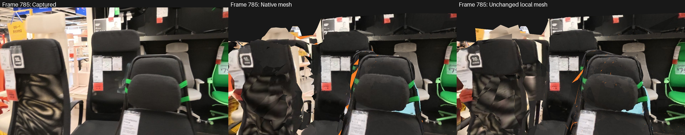
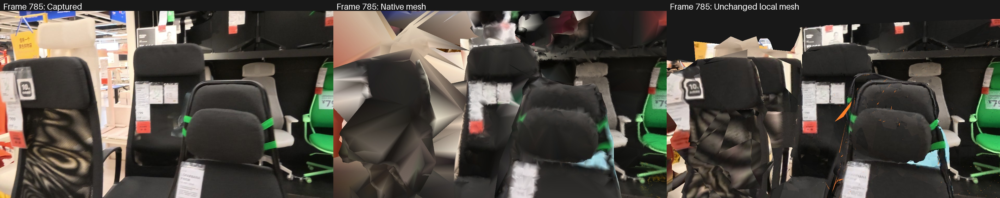
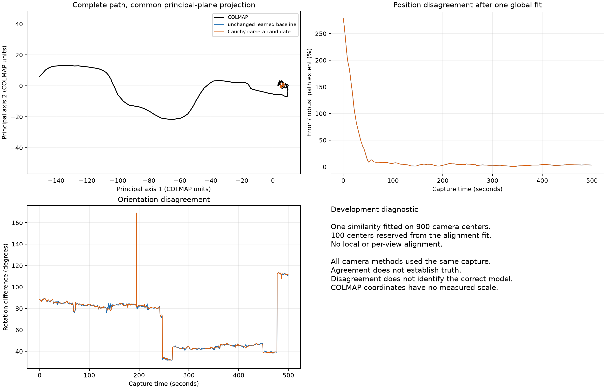

# Native CPU multiview reconstruction on the Mac

Recorded on 2026-09-09 on the M3 Max.
OpenMVS now runs locally from captured photographs through dense points, a triangle mesh, texturing and a standalone GLB.
The completed 24-second chair-section trial remains an unverified research artifact with missing surfaces and geometric disagreements.
It does not establish a faithful complete building.

## Verified release and input

The official [OpenMVS v2.4.0 release](https://github.com/cdcseacave/openMVS/releases/tag/v2.4.0) provides `OpenMVS_macOS_arm64.zip`.
Motrix downloads the 68,347,008-byte archive directly into the local reconstruction tools directory.
Its SHA-256 matches the release asset digest: `3d4c616c97031b1ab6e2eecb0ddd5614fb99513c0782a32c9350602faf38799b`.
`file` identifies the executables as Mach-O arm64, and their runtime logs identify Darwin arm64 and the Apple M3 Max.
The banner's generic “x64” wording is not the executable architecture.
The inspected source is pinned to v2.4.0 in `~/Projects/openMVS`.
OpenMVS uses the [GNU Affero General Public License v3](https://github.com/cdcseacave/openMVS/blob/v2.4.0/LICENSE); this experiment invokes separate local executables and does not vendor that implementation into the Apache-licensed Python code.

The dataset uses the same 43 training and five reserved images as the [higher-resolution Gaussian experiment](gaussian-surface-results.md).
Images retain 1280-by-720 captured pixels, COLMAP calibration and camera poses.
The exporter verifies source hashes, rejects reserved training images and round-trips every exported camera and sparse track association.
It retains 9,661 sparse points observed in at least two training images, with source point reprojection error at most two pixels.
This count differs from the Brush seed because the OpenMVS exporter applies its own documented track and image-boundary selection.
Camera estimation previously used reserved images, so this remains a development consistency check rather than an independent survey benchmark.

## Dense reconstruction and mesh handoff

The CPU trial uses eight threads, 1280-pixel images, five neighboring views, two geometric-consistency iterations and at least two agreeing views during depth fusion.
Automatic ROI cropping and artificial tower points are disabled.
The runtime reports 41 fused depth maps from the 43 input images and exports 377,940 dense points.
The recorded dense stage takes 116.29 seconds in this single run.
The pipeline retains depth maps, command arguments, process IDs, logs, completion records and artifact hashes.

Two importer details required actual end-to-end fixes.
`InterfaceCOLMAP` expects the dataset root containing `sparse/`, not the sparse directory itself.
An MVS interface file does not behave like the native compressed scene format during subsequent meshing.
With compressed output selected, meshing does not automatically load the neighboring dense PLY.

A standalone two-arm experiment uses identical `dense.mvs` and `dense.ply` files.
Implicit point input consumes 9,661 sparse points and produces 8,407 triangles.
Explicit `--pointcloud-file dense.ply` consumes all 377,940 dense points and produces 472,011 triangles.
The native log records the consumed point count before triangulation.
The corrected pipeline always supplies the dense PLY explicitly and uses compressed scene archives for mesh and texture stages.
Earlier attempts remain preserved; their partial outputs are not reported as the final model.

A separate clean run reveals that compressed dense export omits `view_indices` and `view_weights` from its PLY, while retaining them in the native scene archive.
Explicitly loading that geometry-only PLY replaces the scene's visibility metadata and reproduces a native meshing crash.
The working interface-format dense PLY contains both list properties.
The runner therefore uses interface format for import and dense export, compressed format for mesh and texture export, and checks the dense PLY's visibility properties before proceeding or reusing it.
The failed compressed-dense run remains preserved as `trial-clean-no-leveling`.

The final mesh has 236,310 vertices before texture-coordinate duplication and 472,011 triangles.
Hole filling, mesh smoothing and texture sharpening are disabled.
Graph-cut triangulation can still bridge gaps between observations, so disabling hole filling does not certify that every triangle is directly observed.

## Texture comparison on unchanged geometry

The default global and local seam adjustments produce visibly corrupted colors in the native exported PNG itself.
This is upstream of GLB packaging and the Python renderer.
Disabling both adjustments uses identical dense input and produces a byte-identical geometry PLY, SHA-256 `8cb80c6dab9c9958bea810fb3f87625aa653e855bf10f6a2eb3a6c4a8e1c7026`.
Median visible RGB error across five reserved views falls from 0.44397 to 0.07959.
This establishes a useful configuration for this fixture, not the underlying numerical cause or a universal seam-leveling failure.

The native GLB references an external 8192-by-8192 PNG.
Its GLB hash is identical between the two texture variants because the changed pixels live in that external file.
The packaging step therefore records every referenced resource and embeds the texture in a self-contained app GLB.
Round-trip checks verify every triangle index, vertex position, texture pixel and UV coordinate.
The only coordinate conversion is the explicit app-world Y/Z axis flip, reversed during validation.

The corrected-color artifact is:

`reconstructions/openmvs-chair-760/evaluation-no-leveling-final/model/property.glb`

It contains all 472,011 triangles, occupies 30,244,196 bytes and has SHA-256 `84f43f5f4d034c8dfa123f2083c15183d89304138843da19638c81449d204451`.
It is not a reduced preview proxy.

The earlier Trimesh packaging preserved texture pixels but dropped the native `KHR_materials_unlit` extension.
The repaired exporter embeds the original image bytes, preserves the original geometry buffer and material JSON, and adds the explicit axis transform as a parent node.
Its replacement asset is `reconstructions/openmvs-chair-760/evaluation-unlit-preserved-final/model/property.glb`, 30,532,904 bytes, SHA-256 `b24c461e6ff7e18f0a101e897524a4e4b385d192d7d08575021112424dab8576`.
All five coverage, RGB and sparse-consistency results remain identical after this material-preserving repair.
Use this replacement for browser inspection because captured lighting must remain unlit.


## Geometry checks and limitations

All five reserved views use the same cameras, captured RGB and Gaussian-derived depth references as the higher-resolution Gaussian mesh comparison.
The latter depth references measure agreement between models, not ground-truth surface accuracy.

| Original frame | Visible mesh coverage | Gaussian-depth agreement within 5% | Visible RGB error |
|---|---:|---:|---:|
| 765 | 70.13% | 43.19% | 0.08860 |
| 775 | 83.24% | 49.47% | 0.06079 |
| 785 | 88.75% | 54.54% | 0.10758 |
| 795 | 92.28% | 68.80% | 0.07959 |
| 805 | 88.06% | 34.60% | 0.04647 |

Median coverage is 88.06%, compared with 61.92% for the 300,000-triangle Gaussian mesh at the same cameras and resolution.
The assets have different triangle budgets and different reconstruction methods; this is an end-to-end pipeline comparison.
Median Gaussian-depth support is 49.47%, with a minimum of 34.60%, so the existing screening gate fails.
Disagreement alone cannot establish which model is correct.
Visual inspection also shows missing ceiling and floor regions, misplaced chair details and large triangles around weakly observed surfaces.

Direct subpixel rays at the same 4,965 COLMAP observations provide a second consistency check.
Per-view median depth errors among covered observations range from 0.47% to 1.07%.
The fraction of all observations within 5% agreement ranges from 81.72% to 93.22%.
At frame 785, 84.69% of observations agree within 5%, and the covered-observation 95th-percentile error is 8.29%.
These existing triangulated observations participated in camera estimation and are not independent measurements.

The complete textured GLB initially reproduced OpenCV's destination-size limit because more than 32,766 visible samples were passed as one remap column.
The validator now samples in bounded batches without changing interpolation or reducing the mesh.
An end-to-end 65,536-pixel textured-plane regression first reproduces the native assertion and then passes with exact color, coverage and depth agreement.
The complete suite passes 48 tests; Ruff passes the changed code.
The renderer also preserves distinct texture materials, transformed scene nodes and occlusion between textured and vertex-colored geometry.
A physical two-material fixture verifies the complete standalone export, node placement, image colors and depth.
The original five-view textured-mesh results remain identical after extracting the shared renderer and adding material support.

## Photometric refinement on unchanged dense input

The native `RefineMesh` stage completes on the same 377,940 dense points and byte-identical starting mesh.
It uses two image scales, eight views, a regularity weight of 0.2 and no requested decimation or hole closure.
The stage changes vertex positions and triangle topology through photometric optimization and regularization.
It takes 55.18 seconds in this single run and produces 526,181 triangles, compared with the unchanged mesh's 472,011.
Texture seam adjustments remain disabled in both arms.

| Five-view statistic | Unchanged mesh | Refined mesh |
|---|---:|---:|
| Median visible coverage | 88.06% | 87.11% |
| Median visible RGB error | 0.07959 | 0.07992 |
| Mean whole-image PSNR, missing pixels black | 11.50 dB | 11.33 dB |
| Median Gaussian-depth agreement within 5% | 49.47% | 48.86% |

The fraction of all sparse observations agreeing within 5% decreases in each of the five views.
The Gaussian-depth columns remain model-agreement diagnostics, not accuracy measurements.
Visual inspection of frame 785 shows missing ceiling regions, warped chair surfaces and gaps in both arms.
This experiment does not justify enabling refinement by default.



The general captured-view evaluator independently reproduces every sparse-consistency value from the earlier chair-specific evaluator.
It uses the same captured RGB at 1280 by 720, unchanged COLMAP cameras and direct subpixel rays at the existing sparse observations.
It reports coverage and whole-image RGB error without creating a dense depth reference.
Whole-image PSNR includes missing mesh pixels as black, preventing uncovered areas from disappearing from the image comparison.
Its paired baseline is evaluated only on views reserved from both reconstructions.

## Complete captured walkthrough

`prepare_colmap_capture_dataset` now prepares all 1,000 captured images with their existing calibrated cameras.
Exactly 900 images enter dense reconstruction and texturing; 100 frames ending in 5 remain reserved for evaluation.
The training-only sparse export contains 177,447 points.
The full native run at `reconstructions/openmvs-full/trial-1280` uses the unrefined configuration.
Dense reconstruction completes in 2,785.93 seconds with 9,304,339 points.
Meshing completes in 323.75 seconds with 4,559,190 vertices and 9,107,943 triangles.
These are single-run timings on the Mac.

Texturing assigns 4,776,843 patches, then remains inside atlas generation.
Two native samples locate CPU work in the nested patch-containment merge loop in `MeshTexture::GenerateTexture`.
The source compares patches pairwise before packing, making the observed patch count a serious scaling problem.
The process remains active on one CPU rather than demonstrating a deadlock.
It is stopped after approximately 40 minutes, after hashes confirm the dense reconstruction, saved mesh and separate review export remain available.
Only the unsaved texture stage is discarded; the native atlas run is not reported as complete.

A local comparison with `--virtual-face-images 3` increases patch count from 22,313 to 66,952 on the unchanged 472,011-triangle mesh.
Its complete texturing stage takes 78.32 seconds, compared with approximately 49 seconds for the unchanged local configuration.
Median visible RGB error worsens from 0.07959 to 0.08284 across five reserved views, with unchanged geometric coverage.
This arm does not justify applying the option to the full walkthrough.

An alternate export transfers dense-point colors to the unchanged full mesh vertices in 6.16 seconds.
Exactly 4,524,521 of 4,559,190 vertices coincide with a dense point; the rest use their nearest point's color.
The maximum transfer distance is 0.0814 uncalibrated model units.
Every triangle, vertex and exported vertex color passes a round-trip check.
This avoids atlas packing for geometry inspection; color interpolation can still blur appearance.

The complete review asset is `reconstructions/openmvs-full/evaluation-point-colors-v1/model/property.glb`, 182,243,700 bytes, SHA-256 `92aea10e251da6ca4d1c7d95ddad38a0465f943eb5f2c5b7597d6fce6600054a`.
All 100 reserved captured views are evaluated at 1280 by 720.
Median coverage is 99.88%, but minimum coverage is 8.25%, and ten views have coverage below 70%.
Median visible RGB error is 0.13069; mean whole-image PSNR with missing pixels black is 12.89 dB.
High median coverage does not establish correctness: visible false surfaces bridge missing regions.
At frame 795, only 21.82% of 1,622 existing sparse observations agree within 5% depth, compared with 90.44% for the unchanged local baseline.
This confirms a geometric regression in the complete native mesh on that view, independently of the vertex-color appearance change.
The sparse observations still originate in the same estimated calibration and are not survey truth.
The complete native mesh is retained as a failed research candidate.



`evaluate_openmvs_capture` packages all native materials into one standalone GLB while preserving every scene node and triangle.
It verifies geometry, node transforms, texture pixels and UV coordinates after reloading the export.
It checks every reserved source-image hash and camera against the input model, records evaluator source hashes and flushes per-view results as they finish.
Each reserved image receives a comparison artifact at its original evaluation resolution.
The unchanged local mesh supplies a paired baseline on its five common reserved views; that local comparison does not establish a full-building baseline.

The complete estimated camera paths expose a separate unresolved global problem.
A single robust similarity fitted on 900 camera centers cannot make the learned baseline or Cauchy candidate agree with the raw COLMAP path across the walkthrough.
On the 100 remaining centers, the unchanged baseline's median position discrepancy is 3.81% of the reference path's robust extent, but its 95th-percentile discrepancy is 79.36%.
A plain least-squares similarity gives 16.94% and 54.32%, respectively, showing that the conclusion depends on more than one robust-fitting choice.
These normalized values use the norm of the COLMAP path's per-axis 5th-to-95th percentile span, not a measured building dimension.

An alignment-free check compares adjacent camera step lengths.
Median COLMAP-to-learned step ratios are 19.48 in frames 0-99, 1.28 in frames 100-199 and 0.099 in frames 900-999.
Each block uses its 99 internal adjacent frame pairs.
One unknown global monocular scale cannot explain that changing relationship.
Adjacent relative rotations mostly agree locally, with a median difference of 0.53 degrees, but the maximum is 91.70 degrees.
The Cauchy candidate improves the median adjacent rotation difference to 0.17 degrees while retaining the large global disagreement.
These are comparisons of estimated paths, not evidence that either path is the correct building layout.
They prevent treating successful full native meshing or low sparse reprojection error as proof of faithful room connectivity.



## Direct correspondence checks at disputed turns

The camera-path disagreement leads to a read-only test of six image pairs: four selected near large rotation discrepancies and two controls.
Five pairs have enough retained verified correspondences; frame 388-389 has none and is reported as unsupported.
The eleven source images in this test are byte-identical between the captured-frame directory and the COLMAP image directory.
Fresh essential matrices use the final COLMAP intrinsics and reserve every fifth correspondence from the new fit.
The existing camera estimates have already seen these images and database features, so the reserved subset is still a development check.

| Pair | Reserved correspondences | Global COLMAP median Sampson error | Fresh pair median Sampson error | Fresh rotation difference from global COLMAP | Fresh rotation difference from learned baseline |
|---|---:|---:|---:|---:|---:|
| 300-301, control | 230 | 0.25 px | 0.31 px | 0.12 degrees | 0.12 degrees |
| 389-390 | 26 | 0.33 px | 0.44 px | 0.49 degrees | 90.11 degrees |
| 493-494 | 51 | 89.91 px | 0.42 px | 92.13 degrees | 0.53 degrees |
| 764-765, control | 166 | 0.14 px | 0.38 px | 0.13 degrees | 0.55 degrees |
| 954-955 | 19 | 171.12 px | 0.58 px | 82.31 degrees | 0.94 degrees |

Sampson distances are expressed in approximate pixel units using the mean calibrated focal length.
The fresh fits use one fixed RANSAC seed; these are measured outcomes for the listed pairs, not a population accuracy estimate.
At frames 493-494 and 954-955, the global camera solution is inconsistent with the retained pixel correspondences.
At 389-390, the learned baseline has the large rotation discrepancy instead.
This localizes errors upstream of mesh generation without establishing complete building geometry or metric scale.
The 764-765 control has only 42 positive-depth correspondences after pose recovery, so its translation direction remains weakly constrained despite small image residuals.

The native global-mapper log shows that its default configuration decomposes 1,604 additional relative poses and loads 6,197 graph edges.
A separate database copy tests `GlobalMapper.decompose_relative_pose=false` with every other native project option retained.
It loads 4,593 edges and completes in 396.75 seconds in this single run, with the original database hash unchanged.
The result contains two models and 997 of 1,000 base capture images; frames 1, 279 and 532 are absent.
Model 0 covers 467 base images in frames 533-999, and model 1 covers 530 base images in frames 0-531.
Their coordinate systems remain separate.

The follow-up audit uses each model's final estimated intrinsics and the same reserved correspondence indices.
Pair 493-494 improves from 89.91 to 0.23 approximate pixels median Sampson error, with rotation disagreement against the fresh pair fit falling from 92.13 to 0.13 degrees.
Pair 954-955 still has 140.28 pixels median error and 77.32 degrees rotation disagreement.
Pair 389-390 worsens from 0.49 to 8.05 degrees rotation disagreement, with its 95th-percentile Sampson error increasing from 0.65 to 13.59 pixels.
The controls remain below one pixel median error.
This configuration repairs one localized failure but does not resolve the camera problem or establish a complete connected building.
The original global solution and the two-component candidate both remain unverified.

## Reproduction

Use the existing reconstruction environment and verified native binaries.
These commands require fresh output directories and retain failed attempts.

```sh
.venv-reconstruction/bin/python -m artifacts.research.experiments.prepare_openmvs_dataset \
  --dataset reconstructions/brush-chair-760/dataset-colmap-1280 \
  --colmap-text reconstructions/dense-calibrated/global/0/text \
  --output reconstructions/openmvs-new/dataset

.venv-reconstruction/bin/python -m artifacts.research.experiments.run_openmvs_trial \
  --binaries reconstructions/tools/openmvs-v2.4.0 \
  --dataset reconstructions/openmvs-new/dataset \
  --output reconstructions/openmvs-new/trial \
  --seam-leveling off

.venv-reconstruction/bin/python -m artifacts.research.experiments.evaluate_openmvs_trial \
  --trial reconstructions/openmvs-new/trial \
  --reference reconstructions/brush-mesh-760-high1280-median \
  --colmap-text reconstructions/dense-calibrated/global/0/text \
  --output reconstructions/openmvs-new/evaluation
```

`--reuse-dense` optionally accepts an earlier trial with verified completed import and dense stages, matching parameters, binary hashes and input provenance.
An additional clean run, `trial-clean-v2-no-leveling`, completes every native stage without reusing reconstruction artifacts.
Its PLY retains both visibility lists, and subsequent packaging and all five camera-view checks complete successfully.
This run produces 378,639 dense points and 469,550 triangles, demonstrating that a fresh reconstruction is not bitwise deterministic across these runs.
Its standalone asset is `reconstructions/openmvs-chair-760/evaluation-clean-v2/model/property.glb`, 30,232,472 bytes, SHA-256 `ed47599f24a9ba3589ce34fa8df2471f37ae7f2de3959f9fe07cd704c076058e`.
It has 86.51% median coverage, 49.29% median Gaussian-depth support and 0.07775 median visible RGB error.
The clean run also fails the fidelity gate; successful pipeline execution is separate from faithful reconstruction.
The earlier `evaluate_openmvs_trial` comparison deliberately requires the calibrated 760-807 chair fixture and one texture material.
The newer `evaluate_openmvs_capture` supports the complete captured dataset and multiple native materials.
Add `--refine` to the native runner only when explicitly testing the refinement arm; the current evidence favors the unchanged local baseline.
Actual property capture, measured scale, independent dimensions and complete room-connectivity checks remain outstanding.
