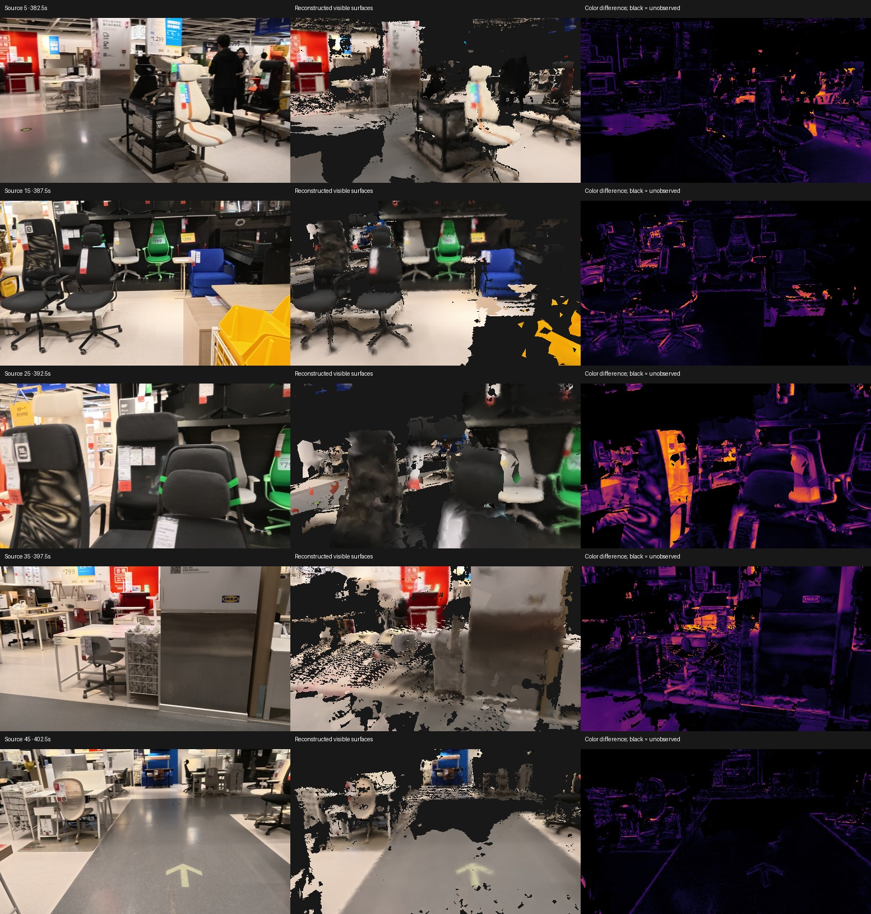
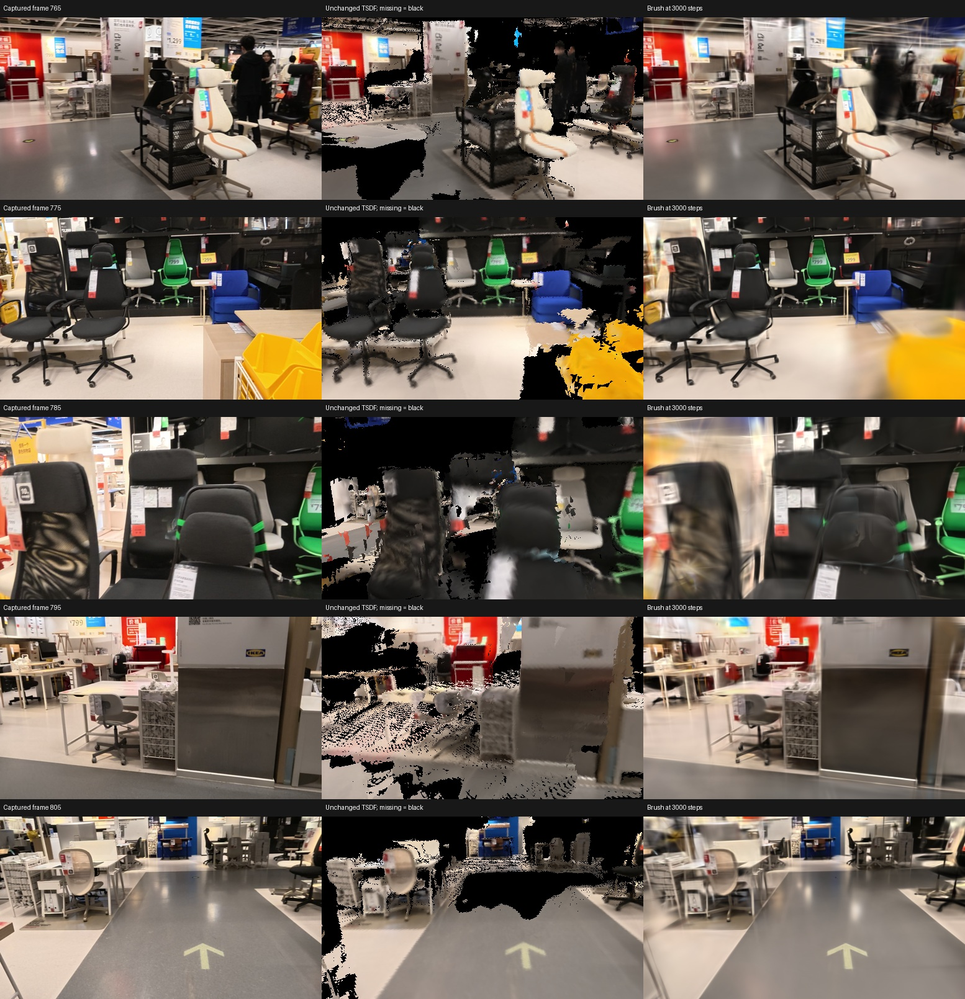
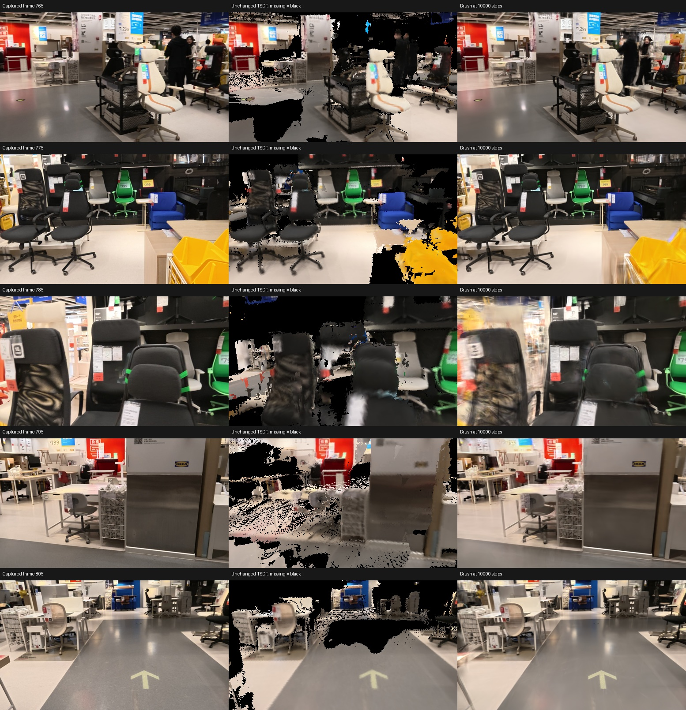

# Image-constrained reconstruction experiments on the Mac

Recorded on 2026-09-09 on the M3 Max with 128 GB of memory.
The input remains the public furniture-store walkthrough, not a supplied property capture.
These experiments improve the pipeline's evidence and local appearance, but do not establish faithful building geometry or metric accuracy.

## Matched depth-correction experiment

The experiment reconstructs original frames 760 through 807, retaining the Cauchy candidate's exact owning-window RGB, intrinsics and registered cameras.
It reserves original frames 765, 775, 785, 795 and 805 from both depth correction and the neighboring RGB used by the correction objective.
The same 43 training views feed each TSDF reconstruction.
Baseline and corrected candidates are both fused, exported to GLB and checked at all five reserved views.
These frames previously participated in learned inference and photogrammetry, so this is a development comparison rather than independent ground truth.

The new depth estimator tests 65 relative-depth hypotheses from half to twice the prior depth.
It compares projected 5-by-5 RGB and normalized grayscale patches in up to six temporal neighbors and requires agreement from at least two sources.
Parallax, texture, absolute matching cost, improvement over the prior and separation from competing depth hypotheses all gate an update.
An optional occlusion mask rejects hypotheses behind a confident neighboring depth surface.
Unaccepted pixels retain their exact prior depth.
The projection follows PyTorch's documented pixel-center mapping for [`grid_sample` with `align_corners=True`](https://docs.pytorch.org/docs/stable/generated/torch.nn.functional.grid_sample.html).

The spatial variant adds four image-guided mean-field iterations over the depth costs.
It shifts neighboring hypothesis distributions to compare absolute depth, accounting for each pixel's different prior.
Strong RGB and depth boundaries weaken coupling.
This is an experimental algorithm assembled for this project, not an implementation of a claimed published benchmark result.

Synthetic tests caught two substantive failures before interpreting real-data results.
Pure camera rotation originally caused unsupported depth changes; requiring measurable depth-dependent parallax fixes that case.
The spatial variant originally normalized away weak boundary weights; preserving their absolute strength prevents a known foreground/background boundary from being erased.
Tests also verify that changing reserved RGB cannot affect training corrections and that reserved depth remains unchanged.

### Analytic MPS comparison

An analytic plane has true depth 2 and an intentionally wrong prior depth of 3.
Errors below include every pixel, including pixels left unchanged.

| Method | Changed pixels | Mean absolute depth error | Median absolute depth error | Pixels within 5% of true depth |
|---|---:|---:|---:|---:|
| Unchanged prior | 0% | 1.0000 | 1.0000 | 0% |
| Independent correction | 9.60% | 0.9057 | 1.0000 | 9.60% |
| Spatial correction | 78.13% | 0.2299 | 0.0121 | 78.13% |

The spatial method improves this constructed plane, while leaving 21.88% of its pixels unchanged.
It does not prove correctness for real furniture, reflections, occlusion or uncertain camera poses.
The saved synthetic result is included in [the generated evidence](evidence/fidelity-spikes.json).

### Real-data outcomes

All three arms use exactly the same unchanged baseline, whose rendered metrics match across runs.
The table reports medians across five reserved views on each exported GLB, except the explicit minimum column.
Depth support compares against the existing learned depth reference, not a surveyed surface.

| Exported candidate | Visible coverage | Depth support | Minimum depth support | Visible RGB absolute error | Screening |
|---|---:|---:|---:|---:|---|
| Unchanged matched baseline | 73.76% | 70.66% | 33.19% | 0.07369 | Failed |
| Independent depth correction | 67.03% | 65.05% | 31.25% | 0.07049 | Failed |
| Spatial depth correction | 66.91% | 64.82% | 31.47% | 0.07271 | Failed |
| Independent correction without occlusion mask | 66.79% | 65.13% | 31.91% | 0.07040 | Failed |

The full meshes also fail screening.
The first correction changes 13.08% of pixels across all 48 frames, including the unchanged reserved frames in the denominator.
It causes an additional 703,134 training pixels to fail the existing depth-edge filter before fusion.
The candidate count falls from 4,808,919 to 4,105,785 out of 6,548,556 training pixels.
Confidence values are unchanged and corrected depth remains positive, isolating this candidate loss to the depth-edge filter.
Spatial regularization and removal of the occlusion mask each fail to recover coverage.
There is no combined spatial-without-occlusion result.

Lower visible RGB error does not establish an improvement when more image regions disappear from the reconstruction.
Visual inspection confirms distorted chair backs and missing floor surfaces.
These failed corrections were not promoted to the complete 1,000-frame reconstruction.



The figure labels use local frame numbers; adding 760 gives the original frame number.
The failing close chair view is local frame 25, or original frame 785.

## Shared 3D Gaussian optimization with Brush

[Brush](https://github.com/ArthurBrussee/brush) trains a shared collection of 3D Gaussians against calibrated photographs and documents native Mac support.
It is relevant because independent per-view depth corrections produced incompatible surfaces in the experiment above.
The local tests use the official [v0.3.0 release](https://github.com/ArthurBrussee/brush/releases/tag/v0.3.0), source commit `3edecbb2fe79d3e2c87eeab85b15e0b1dd10d486`.
The 41,447,012-byte ARM Mac archive was downloaded through Motrix and verified against SHA-256 `65b2631398c839be3c1d4d7160fe2326389dec87830aac0710985e6690a1048c`.
The repository uses the Apache 2.0 license.

Native training runs successfully on this Mac.
The COLMAP trial log identifies the compute device as `Apple M3 Max` with backend `Metal`.
The experiment runs locally without a remote GPU or uploaded capture.

### Dataset and coordinate handling

The adapter writes separate `transforms_train.json` and `transforms_val.json` files, exact RGB PNGs and a colored `initial.ply`.
Brush's inspected NeRF loader restores OpenCV camera axes by flipping the exported Y and Z columns.
The adapter therefore exports `T_nerf = T_opencv @ diag(1, -1, -1, 1)` and leaves world-space points unchanged.
An explicit projection test verifies the actual importer convention.

Real-data preparation rejects accumulated registered rotations whose orthogonality error exceeds the original 0.0001 tolerance.
Inspection finds small near-rigid errors, with singular values near 0.99991 through 1.00010.
The adapter now projects only inputs within 0.001 of a rigid rotation onto SO(3), rejects material scale/reflection, and records every correction.
The largest matrix-entry correction in this dataset is 0.00008544; camera centers are unchanged.
Failed partial datasets remain preserved, and successful preparation uses `dataset-v3`.

The first initialization samples 120,000 points from the unchanged training TSDF.
The second uses COLMAP's own cameras and 9,482 sparse points observed in at least two training images, with per-observation reprojection error below two original-image pixels.
Seed colors for the second initialization come only from training RGB.
Both datasets retain identical images and the same 43/5 split.
COLMAP camera and seed geometry change together, so the comparison does not isolate camera quality alone.
COLMAP itself used all images; reserved RGB is excluded only from Brush optimization.

### Initial appearance comparison

Both trials use 3,000 steps, 500-step evaluation/checkpoint intervals, a 500,000-splat cap, refinement every 100 steps and growth until step 2,000.
The unchanged TSDF is rendered with black missing pixels for the following full-image comparison.
The RGB metrics include every pixel and use the same source PNGs for all methods.
They are different from the earlier visible-only RGB metric and must not be compared directly with that column.

| Method | Mean full-image PSNR, dB | Mean full-image RGB error | Frame 785 PSNR, dB |
|---|---:|---:|---:|
| Unchanged TSDF | 10.22 | 0.18734 | 8.34 |
| Brush, registered cameras and TSDF seeds | 19.64 | 0.06122 | 14.61 |
| Brush, COLMAP cameras and sparse seeds | 21.71 | 0.04807 | 18.45 |

The first trial completes in 49.86 seconds and the COLMAP trial in 21.28 seconds, including evaluation and exports.
These are individual local runs with different initialization sizes, not a controlled throughput benchmark.
The COLMAP trial exports 48,755 Gaussians at its final checkpoint.
Native evaluation already simulates an eight-bit round trip before computing its log metrics.
The comparisons here recompute metrics from the actual saved PNGs, whose values differ slightly from the native evaluation tensors.

The COLMAP initialization improves reserved-view appearance, but chair edges still show blur and ghosting.
A Gaussian PLY is a volumetric appearance representation, not a verified building surface mesh.
No dimension, floor-plan, wall thickness or unseen-surface claim follows from these image scores.
The existing mesh fidelity failures remain open.



### Longer COLMAP trial

A fresh 10,000-step trial keeps the same 9,482-point initialization and 43/5 split, while allowing growth until step 8,000.
It reaches the 500,000-Gaussian cap and completes in 151.54 seconds, including evaluation and exports.
The final mean full-image PSNR is 23.51 dB and mean full-image RGB absolute error is 0.03849.
Frame 785 remains weak at 18.33 dB, slightly below its 18.45 dB result in the shorter trial.
Thus the improved mean does not establish uniformly improved reconstruction.
The worst view still contains ghosted edges and a blurred region behind the chairs.

The final model is `reconstructions/brush-chair-760/colmap-10000/export_10000.ply`.
It contains 500,000 Gaussians, occupies 118,001,551 bytes and has SHA-256 `90673b5d998218fd4dd0d4f78af0ce52f5f69490222adbbada6449b42cbf4273`.
It represents this 24-second section only; no full-walkthrough Brush model or Gaussian-derived surface mesh has been validated.



## Reproduction and retained outputs

Run experimental scripts from the repository root in `.venv-reconstruction`.
Each preparation, training and evaluation command requires a new output directory and preserves existing results.
Training writes configuration, binary and dataset hashes, a PID record, a durable log, periodic Gaussian PLYs, reserved-view renders and a completion record.
PLY checkpoints do not include optimizer state; they must not be described as exact training resumes.

```sh
.venv-reconstruction/bin/python -m artifacts.research.experiments.prepare_brush_dataset \
  --source reconstructions/photometric-depth-760/baseline \
  --output reconstructions/brush-chair-760/dataset-new --points 120000

.venv-reconstruction/bin/python -m artifacts.research.experiments.prepare_colmap_brush_dataset \
  --dataset reconstructions/brush-chair-760/dataset-new \
  --colmap-text reconstructions/dense-calibrated/global/0/text \
  --output reconstructions/brush-chair-760/dataset-colmap-new

.venv-reconstruction/bin/python -m artifacts.research.experiments.run_brush_trial \
  --binary reconstructions/tools/brush-v0.3.0/brush-app-aarch64-apple-darwin/brush_app \
  --dataset reconstructions/brush-chair-760/dataset-colmap-new \
  --output reconstructions/brush-chair-760/colmap-new
```

`evaluate_brush_trial.py` compares every saved checkpoint with the unchanged TSDF and checks exact agreement of reserved images across runs.
The complete three-trial evaluation is retained at `reconstructions/brush-chair-760/evaluation-final/results.json`.
`summarize_fidelity_spikes.py` regenerates the committed evidence from the retained local outputs.
The complete test suite passes 39 tests after the camera adapter and depth-correction changes.

The next geometric question is whether a coherent Gaussian model can recover trustworthy surfaces and preserve structure across the full walkthrough.
It requires geometry checks beyond RGB agreement and explicit review of sparse, reflective, dynamic and unobserved regions.
An actual property capture, measured scale anchor and independent dimensions are still needed for the real estate acceptance check.
